# Visibility and Retail Demand: Evidence from Bike Share

Jordan Hutchings (Rotman School of Management, University of Toronto) and Avi Goldfarb (Rotman School of Management, University of Toronto — https://www.avigoldfarb.com/)

- Status: Revise & resubmit, Marketing Science
- Award: Best in Track, Evidence from the Field — Marketing Science Conference 2025
- Links — PDF: https://www.jordanhutchings.com/pdf/visibility_and_retail_demand.pdf ; SSRN: https://papers.ssrn.com/sol3/papers.cfm?abstract_id=5749902
- Working paper dated November 2025

*Machine-readable markdown rendition of the working paper (generated 2026-07-09). The PDF is authoritative.*

(Title-page footnote: Jordan Hutchings: jordan.hutchings@rotman.utoronto.ca. Avi Goldfarb: avi.goldfarb@rotman.utoronto.ca. We thank Rene Thiang and Ruth Zhang for excellent research assistance; seminar participants at the University of Toronto; and attendees at the ISMS Marketing Science Conference and the ET Symposium for helpful comments.)

## Abstract

Storefronts are central to how retailers convert passerby traffic into customers, yet rigorous evidence on role of a storefront remains limited. Instead, retail models tend to emphasize proximity to consumers as a predictor of retail traffic and sales. We examine the role of storefront visibility, rather than location per se, in driving retail traffic by linking the staggered expansion of shared bike networks in New York City and Boston with high-frequency cellphone mobility data on more than 1000 retailers. New bike share stations create a plausibly exogenous surge in passerby traffic. Using exact bike share station locations, we measure line-of-sight observability between stations and storefronts. Our results show that only visible retailers experience significant gains in store visits after the opening of a bike share station. Storefront features like informative signage and legible fonts further amplify these effects. These findings highlight the marketing communications role of storefront visibility.

*Key words*: retail demand, visibility, proximity, bike share, micromobility

## 1 Introduction

The question of where firms choose to locate lies at the heart of both economics and marketing. For nearly a century, research has examined how travel costs, population density, and competitive positioning shape retail performance. Classic models by Reilly (1931), Hotelling (1929), and Huff (1962, 1964), along with the applied frameworks of Applebaum (1965, 1966) and Applebaum, Kornblau, et al. (1968), established that retailer success depends on being easy to reach by consumers. Contemporary approaches continue this tradition, integrating consumer geography, travel costs, and strategic entry behavior in order to link spatial differentiation and firm competition (Davis 2006; Seim 2006; Jia 2008). Yet, these perspectives treat consumer exposure as incidental, overlooking how being seen in the course of everyday consumer movement generates demand. An exception arises in the marketing literature on servicescapes and atmospherics, which highlight the role of exterior cues in shaping consumer perceptions (Bitner 1992). However, even within these areas of literature, there remains a call for causal evidence from real-world settings (Lecointre-Erickson et al. 2024; Pantano, Priporas, and Foroudi 2019).

Estimating how observability affects the consumer decision to visit a retailer is empirically challenging. Firms face a trade-off between higher rents and high traffic and visibility, where more observable and high-traffic locations tend to bring in higher rental costs (Aguirregabiria and Suzuki 2016). As a result, we expect sorting into retail locations. Better-performing firms can afford premium lots with more passerby traffic, while firms which rely less on drawing in passerby traffic can locate in areas with lower exposure. To isolate the causal effect of observability itself, we need variation in the consumer exposure of a location that is independent of the firm's endogenous own choices.

We address the problem of firms self-selecting into more observable and profitable locations by using plausibly exogenous expansions to the micromobility bike share networks in Boston and New York City. An important feature of these bike share networks is that the users are required to pick up and return the bicycle from a finite and fixed set of stations. An example of a bike share station and its surrounding retailers is shown in Figure 1 where bike share users will complete their trip outside a set of retailers.

**Figure 1. A bike share station outside retailers in Boston**

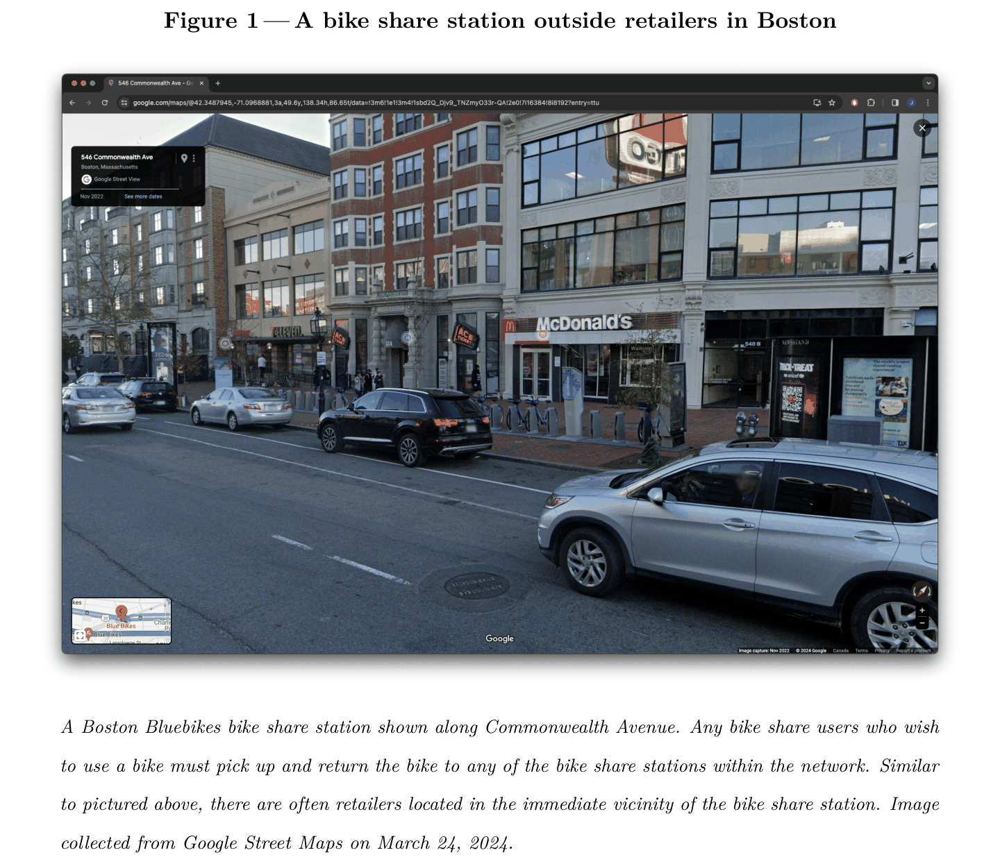

A Google Street View screenshot of a Boston Bluebikes bike share station along Commonwealth Avenue (846 Commonwealth Ave). A row of docked blue bikes sits on the sidewalk directly in front of a block of retailers, including a clearly visible McDonald's storefront and several other shops; cars are parked along the street in the foreground. Original figure note: "A Boston Bluebikes bike share station shown along Commonwealth Avenue. Any bike share users who wish to use a bike must pick up and return the bike to any of the bike share stations within the network. Similar to pictured above, there are often retailers located in the immediate vicinity of the bike share station. Image collected from Google Street Maps on March 24, 2024."

Our paper combines data on bike share station openings in Boston and New York City with cellphone mobility data to examine how nearby retailers benefit from increased passerby traffic following the installation of a bike station. We also use mapping data and archival images of each store to determine whether the store is visible from the station and to document changes in its storefront appearance.

When a new station is added to the network, it draws riders to its exact position. As documented by Kim and McCarthy (2024), micromobility can provide a lift to local businesses. They show restaurants saw an increase in spend following the introduction of dockless scooters.[^1] Cellphone mobility data allows us to observe monthly retail traffic for almost all retailers in Boston and New York City, including those near the bike stations (Hou et al. 2025). During our study period of 2018 and 2019, Boston added 260 stations and New York added 230 (on top of 256 and 832 respectively). To accommodate this staggered adoption of the treatment, we use the Callaway and Sant'Anna (2021) group-time estimator.

[^1]: In contrast, Wen et al. (2024) find that new bike share stations in Queens New York do not increase visits to restaurants as measured in cellular mobility data. While our focus is on visibility rather than the overall effect, we include a discussion below of possible reasons why our results on the overall effect are different from theirs.

Our identifying assumption is that the location of these bike share stations is exogenous to changes in retailer demand within a short distance of the station over time. Our central results rely on the weaker assumption that the location of these bike share stations is exogenous to changes in demand to retailers whose storefronts are visible from the bike share station compared to retailers that are similarly proximate to the station but whose storefronts are not visible.[^2]

[^2]: Locations were selected based on safety and network distribution requirements, as well as a considerable public outreach effort (New York City Department of Transportation 2013a, 2013b; City of Boston Analytics Team 2024). While retailers could participate through the public outreach effort, in our view it is unlikely that stations were chosen to be visible specifically to retailers that anticipated an increase in traffic for reasons independent of the new bike stations.

We find that retailers located within 100 meters of a new bike station receive a 3.8% increase in monthly store visits. This is consistent with the results of Kim and McCarthy (2024) on the impact of micromobility stations on restaurant demand. We then examine whether there are differences between visible proximate retailers and other proximate retailers, to assess whether it is the observability of the retailer rather than proximity per se that generates the increase in traffic (Rogers 2003). We measure visibility by constructing a line-of-sight algorithm from open-source publicly available data. Using a geospatial representation of each city, we determine where the storefront is positioned on the retailer's lot, and then check whether there exists a set of unimpeded sight lines between the storefront and station.[^3] Retailers which have observable storefronts see an average monthly visit increase of about 10% after six months, compared to an approximately 4% point estimate increase for non-visible retailers.

[^3]: We provide more details of our algorithm and the data used in Section 4.1.

To further assess the role of observability, we hand-collected archival images of each storefront during our study period, and classified whether each storefront was informative, easy-to-read, and well kept. Storefronts that are either uninformative, difficult-to-read, or poorly kept show little change from the increase in passerby traffic when a bike share station opens nearby. These results can be seen as a mechanism check on our visibility results, while documenting that several storefront features, as hypothesized in the servicescapes and atmospherics literature (Kotler 1973; Baker et al. 2002; Sample, Sevilla, and Haws 2025), affect retail traffic.

Overall, these findings highlight visibility as a critical but overlooked determinant of retail success. Our results underscore that location decisions and exterior design strategies are complementary: the visible storefront serves a marketing communications role, drawing passerby traffic more than simple proximity as emphasized in discussion of channel strategy.

## 2 Related literature

The study of retail location has consistently focused on one key insight, successful locations minimize the distance between stores and consumers. The earliest models, such as Hotelling's spatial competition model (Hotelling 1929) and the "Law of Retail Gravitation" (Reilly 1931), established this principle by showing how proximity to consumers and market size influence demand. Built on these deterministic models were probabilistic models such as the Huff Gravity Model (Huff 1964), which recognized that consumer choice is not rigid but a probability depending on both store size and travel distance. These theoretical concepts were complemented by practical tools like the checklist and analog methods for site selection (Applebaum 1965, 1966; Applebaum, Kornblau, et al. 1968). More recent empirical work continues this tradition, studying industries like movie theaters (Davis 2006) and video retail (Seim 2006) to analyze firm equilibrium and expansion strategies, demonstrating that local consumer density and competitive proximity remain the determinants of retail success (Jia 2008). Wang and Goldfarb (2017) examine retail choice and infer that storefronts serve as a billboard separate from proximity effects, as the opening of offline stores lead to online sales.

As consumer mobility data has become more readily available through the rise of smartphone location data, researchers are able to model the consumer retail decisions as a function of their surrounding options (Hou et al. 2025). Modern tools allow for estimating diverse consumer preferences for different location types (Athey et al. 2018), as well as following the consumer store visit decisions through their entire trip-chain (Miyauchi, Nakajima, and Redding 2025).

Separate from the consumer choice literature, a stream of research has focused on how managers can shape the consumers' store image by taking actions within the store. This research emphasizes that, in addition to classical factors like location and price, the consumer's choice is shaped by the store's "personality" (Martineau 1958). This personality is primarily conveyed through the store environment itself. The atmospherics literature, as described by Kotler (1973), treats environmental design, including color, layout, brightness, and broader sensory inputs, as a deliberate marketing tool. The store's image is subsequently formed through cue utilization (Mazursky and Jacoby 1986), where consumers use information from the physical space to categorize the retailer. Subsequent applied studies shaped how ambiance, design, and social cues shape consumers' inferences about merchandise and service quality (Baker, Grewal, and Parasuraman 1994), and these factors directly influence store-choice criteria and patronage intentions (Baker et al. 2002). While these studies often focus on actions taken within the store, a smaller literature focuses on actions outside the store by examining storefront design and the influence this has on patronage. Lab studies of window transparency and storefront design show that display content and execution influence entry and product purchase, with effects varying by consumers' category knowledge (Sen, Block, and Chandran 2002; Cornelius, Natter, and Faure 2010). Sample, Sevilla, and Haws (2025) show that consumers prefer storefront designs which give insight into the product offerings. Thus the storefront plays a role as a marketing communications tool.

Storefronts serve this role because they are easily observable. Rogers (2003) lists observability as a key driver of the diffusion of new products, which Moore and Benbasat (1991) refines by identifying two separate dimensions: visibility, the extent to which adoption is publicly seen by others; and result demonstrability, the extent to which benefits of the product are tangible and easily communicated. The visibility channel covers a body of research documenting how choices by others influence consumer behavior. For example, informational cascades (Banerjee 1992; Bikhchandani, Hirshleifer, and Welch 1992), productivity gains from observing and learning the actions of more efficient workers (Mas and Moretti 2009; Chan, Li, and Pierce 2014), in-airline purchases (Gardete 2015), and adoption patterns for durable goods such as solar panels (Bollinger, Burkhardt, and Gillingham 2020; Bollinger et al. 2022) and hybrid vehicles (McShane, Bradlow, and Berger 2012).

Separate from the visibility social communication channel are the result demonstrability marketing communications channel. This type of visibility effect, where the consumer adopts the product because the benefit itself is visible, is not the focus of our study.

Finally, our work relates to a literature examining connections between transportation networks and urban amenities. Public transit expansions reduce travel costs and increase nearby property values (Bowes and Ihlanfeldt 2001; Gupta, Van Nieuwerburgh, and Kontokosta 2022). Reducing access costs has been seen to benefit tourist areas (Yang, Jiang, and Zhang 2021), and restaurants (Gorback 2020). Particularly relevant to our study are papers in the micromobility space examining the effects of bike share and scooter expansions. When deciding where to site bike share stations, Kabra, Belavina, and Girotra (2020) find 80% of bike share ridership comes from users who are within 300 meters of a bike share station. Kim and McCarthy (2024) show that the adoption of dockless scooters by US cities increased restaurant spend.

Perhaps most directly related to our study, Wen et al. (2024) study the spillover effects of bike share stations in Queens, New York. The authors use cellphone data to track the patronage at restaurants, emphasizing the home location of the phone owners. They use difference-in-differences to show the number of local patrons fall after the arrival of bike share stations, with no significant change in distant patrons coming into to visit the Queens' restaurants. In contrast to our study, Wen et al. (2024) find a decline in retail traffic after the opening of bike share stations. Our results may differ from theirs because they focus on stations on the peripheral of the city that may draw people into downtown, while we have stations in both the central city and outlying areas. We also have stations from two different cities and our main results emphasize retailers that are visible from the bike station.

## 3 Data and setting

**Data on retail traffic:** We measure consumer decisions to visit retailers with cellphone mobility data provided by Advan (formerly SafeGraph). The data provides monthly counts of the number of total and unique visitors to all the points-of-interest within their sample. The Advan sample of consumers covers approximately 7% of U.S. mobile devices, and prior work shows that Advan's visitation measures are broadly representative of the U.S. population and business registry, and are stable over time (Li et al. 2024). Following the empirical literature, we interpret monthly store visits as a proxy for consumer demand and the number of people entering the store per month. We focus on retailers following the definition of retailer used by Babar and Burtch (2024). These are determined by the North American Industry Classification System (NAICS) codes outlined in Table 2 and include restaurants, department stores, convenience stores, grocery retailers, pharmacies, and other frequently visited consumer-facing businesses.

**Data on bike share station entry:** We observe bike share network expansions through completed bike share trip data. We collect every bike share trip taken in the Boston Bluebikes and New York City Citibike networks from January 2017 through December 2019 (Citi Bike / Lyft, Inc. 2025; Bluebikes / Lyft, Inc. 2025).[^4] These data provide the start and end trip timestamps and exact pickup and drop-off locations of the bicycle for each trip. In total, we observe 78.92 million bike share trips. Importantly, this data provides the exact coordinates of each bike station, as well as the date when the station is made open to the network. The latitude and longitude coordinates are precise enough to locate the exact point along the street where riders will be finishing their trips, which is essential for constructing our visibility measure.[^5] We present the set of bike share locations prior to and through our sample below in Figure 2.

[^4]: Our study focuses on Boston and New York City, but we identified seven other US cities that have substantial bike share systems with public data on station locations: Chicago, Honolulu, Los Angeles, the Bay Area, Minneapolis, and Washington DC. Data limitations make it infeasible to examine the relationship between station openings and retail traffic in these cities. Listed below are the reasons we were unable to incorporate these cities in our analysis. The Bay Area, Los Angeles, and Honolulu have docked and dockless bike share systems, meaning the start and end points of rider trips are not consistent over time. Dockless bikes remove the requirement that bike trips must finish at a fixed station, and riders can bike to their destination. Chicago and Philadelphia's systems did not undergo large enough expansions during the period in which we observe retail passerby traffic. Lastly, Minneapolis and Washington DC have bike trip logs which do not provide the bike station's coordinates. Their logs provide the station at the nearest roadway intersection, which is not precise to identify visible and non-visible retailers.

[^5]: In contrast, using data from press reports or public announcements of bike share station locations does not give precise information on the location or the date of opening.

**Figure 2. Expansion of bike share stations in (a) Boston and (b) New York City, 2018–2019.**

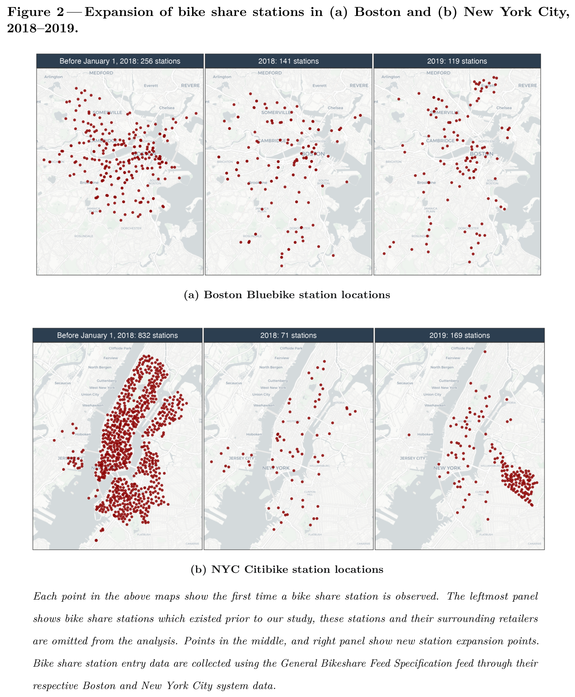

Two rows of three map panels each, plotting station locations as red dots on gray city basemaps. Panel (a), Boston Bluebike station locations: "Before January 1, 2018: 256 stations" (dense coverage of central Boston, Cambridge, and Somerville), "2018: 141 stations", and "2019: 119 stations" (new stations spreading outward toward Medford, Everett, Revere, and southern neighborhoods). Panel (b), NYC Citibike station locations: "Before January 1, 2018: 832 stations" (dense coverage of Manhattan and western Brooklyn), "2018: 71 stations", and "2019: 169 stations" (2019 additions concentrated in a dense cluster in Brooklyn/Queens to the southeast). Original figure note: "Each point in the above maps show the first time a bike share station is observed. The leftmost panel shows bike share stations which existed prior to our study, these stations and their surrounding retailers are omitted from the analysis. Points in the middle, and right panel show new station expansion points. Bike share station entry data are collected using the General Bikeshare Feed Specification feed through their respective Boston and New York City system data."

**Data on retail visibility:** In order to determine whether a retailer is visible from the bike share station, we build a three-dimensional map of Boston and New York. We make use of the Census TIGER data to understand the roadway networks in both cities,[^6] as well as the Microsoft US Building Footprints data to identify the locations of every building in each city. The building footprint data are constructed from satellite images, where the building footprints are traced with convolutional neural networks.[^7] We go into further detail about how we construct our visibility measure in Section 4.1.

[^6]: US Census Topologically Integrated Geographic Encoding and Referencing data can be collected here: https://www.census.gov/geographies/mapping-files/time-series/geo/tiger-line-file.html

[^7]: Microsoft US Building footprint data source and documentation on the data construction: https://github.com/microsoft/USBuildingFootprints

**Data on storefront visible features:** For each retailer in our data, we collected images of the storefront with Google Street View. Google Street View images are captured longitudinally by a Google Car's 360-degree camera. We used the Street View "see more dates" feature to collect historical images of the storefront during our period of study. For periods where the storefront was observed outside of 2018 and 2019, we use the nearest capture date. The collected images allow us to verify the retailer was actively present at the location claimed in our data during our sample period. These data allow us to extract storefront specific features of the data which may heighten, or dampen the consumers' perception of the storefront.

In total, of the 840 retailers near a new bike share station in the Advan data, we found 283 were either never present, entered, or had closed during the sample. Our research assistants flagged each of these cases, and cross-referenced the case with secondary sources. These sources include online reviews and news articles. We estimate our main results dropping these firms, and show robustness to including these firms in online appendix. We reach the same qualitative conclusions when we keep these firms, but find attenuated results likely due to the inclusion of empty and non-retail properties.

## 4 Empirical strategy

We use bike share network expansions as plausibly exogenous shifts in passerby traffic. We then compare the change in monthly store visits for retailers before and after a bike share station opens nearby. We emphasize differences between visible and non-visible stores. Figure 3 shows the staggered roll out of bike share stations across both cities. The dashed lines represent the proportion of docked bike share stations prior to our study period. We've scaled both trends to be relative to the total number of stations in each network at the end of 2019. Boston underwent two significant expansionary periods, in the summers of 2018 and 2019, where NYC had more gradual expansion over the same time period.

**Figure 3. Boston and New York City underwent substantial bike share growth**

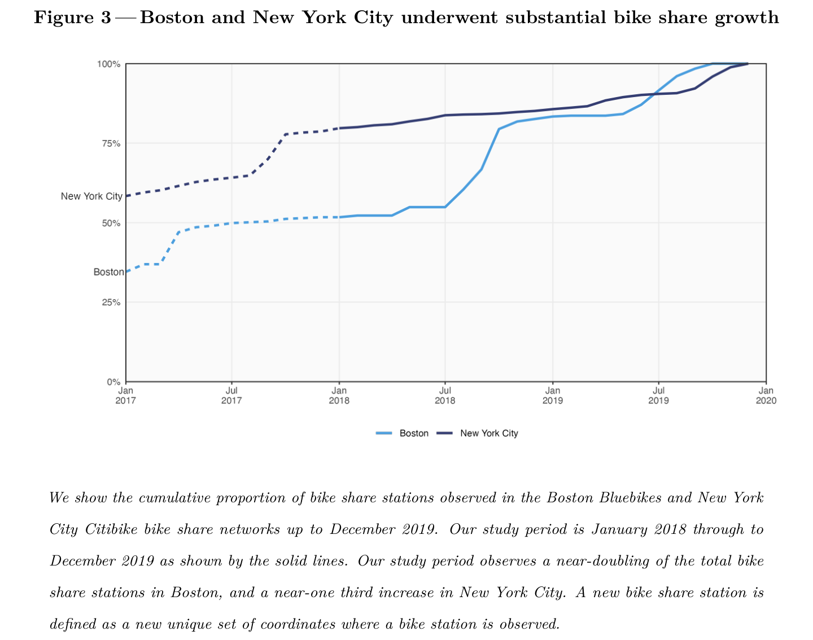

A line chart of the cumulative proportion of bike share stations (0% to 100% on the y-axis) from January 2017 to January 2020, with a light blue line for Boston and a dark navy line for New York City; dashed segments mark the pre-study period (before January 2018) and solid segments the study period. New York City starts near 57% in early 2017, sits around 80% by January 2018, and grows gradually to 100% by the end of 2019. Boston starts near 33%, is just above 50% at the start of 2018, jumps sharply to roughly 80–85% in the summer of 2018, plateaus, then rises again in the summer of 2019 to reach 100%. Original figure note: "We show the cumulative proportion of bike share stations observed in the Boston Bluebikes and New York City Citibike bike share networks up to December 2019. Our study period is January 2018 through to December 2019 as shown by the solid lines. Our study period observes a near-doubling of the total bike share stations in Boston, and a near-one third increase in New York City. A new bike share station is defined as a new unique set of coordinates where a bike station is observed."

Given the staggered-adoption nature of the treatment, we estimate our main results using the Callaway and Sant'Anna (2021) group-time estimator.[^8] This group-time estimator accounts for staggered treatment timing and avoids the "forbidden comparisons" problem that can bias traditional two-way fixed effects estimators under heterogeneous treatment effects (Goodman-Bacon 2021; Borusyak, Jaravel, and Spiess 2021). The estimator recovers group-time average treatment effects by retailer cohort, defined by the month and year of treatment, which we then aggregate using the Callaway–Sant'Anna weights to obtain dynamic event-study and static average treatment effects. As this estimator requires there to be at least one pre-period and one post-period, we use only cohorts which are treated in the interior 22 of the 24 total months in our sample.

[^8]: While our main results are with Callaway and Sant'Anna (2021), we show robustness to a suite of other group-time estimators in the online appendix, including the Two-way Fixed Effects estimator.

This approach relies on the following identifying assumptions. First, the path of firms, if not treated, is parallel to the path of never treated firms (Callaway and Sant'Anna 2021). This assumption is analogous to the TWFE DiD parallel trends assumption, but applies to the setting with staggered adoption.[^9] Our event study results provide a testable framework for this assumption by inspecting the preperiod coefficients (Rambachan and Roth 2023). The second identifying assumption requires limited anticipation by retailers prior to being treated. We find some treated retailer cohorts experience a dip in store visits in the month prior to treatment. This may be explained by obstructions to traffic caused by the construction of the bike share station. While the construction process is quite quick, the newer bike share stations use metal plates which are bolted into the concrete and do not require excavating, these constructions are also triaged to be done alongside with other sidewalk work, which can take weeks to complete. This process obstructs the passerby channels and may limit the retailer's exposure to the public. Specifications which do not account for the anticipation will have artificially inflated coefficients as they are measured relative to the period prior to treatment. Our group-time estimators allow for specifying the period the coefficients are measured against, where we estimate relative to two months prior to treatment. As a result, any "anticipation" or impacts in the month prior to treatment will be observed in the estimated event study coefficient in the period prior to the bike share station opening.

[^9]: We use the set of nearest-neighbor matched retailers as the never-treated firms as the controls in the main specification, however we also show the results using the not-yet-treated firms in the online appendix, which leads to the same conclusions. In addition, our set of retailers only contains retailers which are present for the entire duration of the sample. We do not measure effects for retailers which enter or exit the market, which may be in response to the newly added bike share stations.

### 4.1 Constructing retailer visibility

Crucial to our focal analysis is a measure of how observable the retailer storefront is to passerby traffic. We develop our visibility classification algorithm building on the approach taken by Bollinger et al. (2022). This process is done in two steps. First the exact positioning of the storefront is determined. A storefront is defined as the exterior of the building which contains visible information about the retailer. Second, using the geospatial building data, we evaluate whether a set of sight lines from the storefront to the bike station are impeded by any surrounding buildings. Given that the bike share network is within the city, we assume that buildings are the main source of visibility obstruction.

For a given retailer, we use geospatial building footprint data and its surrounding roadways to determine the exact coordinates of the storefront.[^10] We start by identifying the building footprint which envelopes the retailer coordinates. Then, we match the surrounding roadways with the street address of the retailer. We draw the shortest path between the retailer and address matching street. The point along this line which intersects the building's footprint is then classified as the storefront. As shown below in Figure 4, a straight line is drawn connecting the retailer centroid with its corresponding roadway. The point along the exterior of the building intersected by the straight line is set as the storefront.

[^10]: Building footprint data is collected from the Microsoft US Building Footprints dataset, a dataset which uses DNNs to outline building footprints from satellite images, https://github.com/microsoft/USBuildingFootprints. Roadway data is taken from the US Census TIGER database, https://www.census.gov/programs-surveys/geography/guidance/tiger-data-products-guide.html.

**Figure 4. Classifying retailer storefront coordinates**

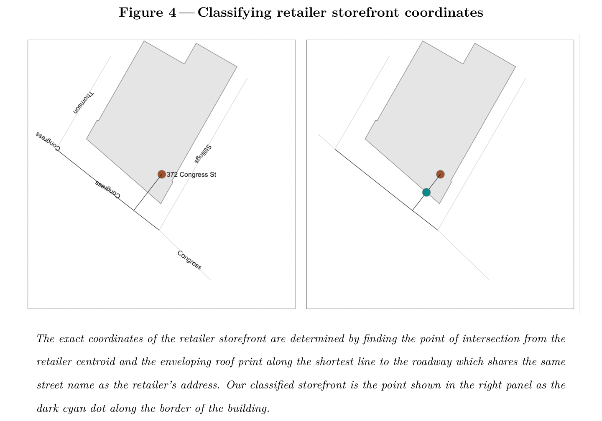

Two side-by-side map diagrams of the same building footprint (gray polygon) at 372 Congress St, bounded by roadway lines labeled Congress, Thomson, and Stillings. The left panel shows the retailer's point coordinate (a brown dot) inside the building footprint with its street address label. The right panel shows the constructed shortest line from the retailer centroid to the address-matching roadway (Congress St), with a dark cyan dot at the point where this line crosses the building's exterior — the classified storefront location. Original figure note: "The exact coordinates of the retailer storefront are determined by finding the point of intersection from the retailer centroid and the enveloping roof print along the shortest line to the roadway which shares the same street name as the retailer's address. Our classified storefront is the point shown in the right panel as the dark cyan dot along the border of the building."

We check whether the identified storefront is visible from the bike station. In order to do this, we pad the bike share station's coordinates by 5 meters. This is done to accommodate the size of the bike station, as well as allowing for visible channels within the moments after a rider completes a bike trip. This padding now introduces a set of sight lines where the storefront can be seen from, rather than just one direct channel from bike station to storefront.[^11] We characterize the set of sight lines between the bike station and retailer storefront with three lines: the direct line between the two, and two tangent points from either side of the disc created by the bike station padding. If any of these sight lines are unobstructed by a building, we classify the retailer as visible, otherwise, the retailer is classified as being within-proximity of the bike share station, but not visible as there is not a clear line of sight between the two. Therefore we define retailer visibility as a measure of whether or not at least one of the three sight lines do not intersect another building.

[^11]: The set of sight lines can be thought of as an infinite number of lines from within the bike station disc, point padded by 5 meters, converging to a point we deem to be the storefront.

We determine the three representative sight lines by solving for the intersection of two discs; the padding disc around the bike station, and a disc centered at the storefront with radius equal to the distance to the bike share station. As shown in Figure 5, our tangent sight lines are described by the intersection points of the two discs. The direct sight line is described by truncating the station-end of the line at the 5 meter buffer.[^12]

[^12]: We rely on the {sf} R package (Pebesma 2018) for these operations. This geometric representation to describe the sight line drastically reduces the number of calculations required to verify unobstructed sight lines as it removes the need to check whether a building intersection occurs past the bike station.

**Figure 5. Constructing sight lines based on intersection of two discs**

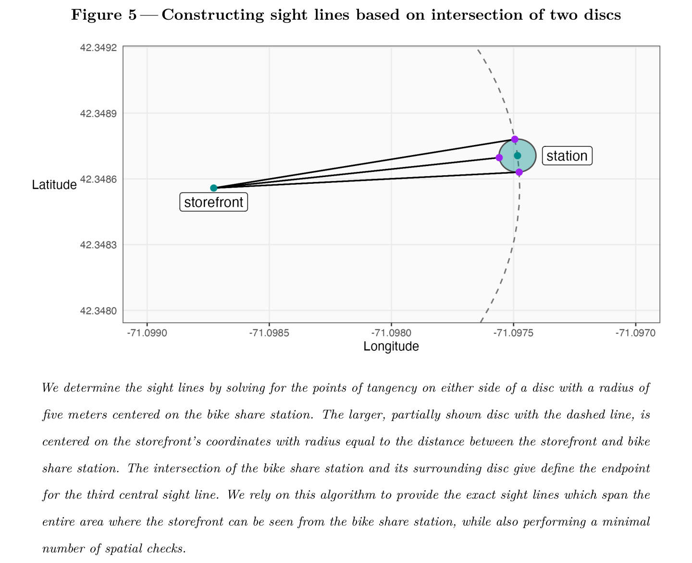

A coordinate diagram (longitude roughly -71.0990 to -71.0970, latitude roughly 42.3480 to 42.3492) showing a labeled "storefront" point on the left and a labeled "station" point on the right surrounded by a small shaded disc (the 5-meter padding). A large dashed arc — part of a disc centered at the storefront with radius equal to the storefront-station distance — passes through the station area, and its two intersection points with the station's padding disc (marked with purple diamonds) define the endpoints of the two tangent sight lines. Three black lines radiate from the storefront: the two tangent lines and the central direct line truncated at the disc boundary. Original figure note: "We determine the sight lines by solving for the points of tangency on either side of a disc with a radius of five meters centered on the bike share station. The larger, partially shown disc with the dashed line, is centered on the storefront's coordinates with radius equal to the distance between the storefront and bike share station. The intersection of the bike share station and its surrounding disc give define the endpoint for the third central sight line. We rely on this algorithm to provide the exact sight lines which span the entire area where the storefront can be seen from the bike share station, while also performing a minimal number of spatial checks."

Our process is completed for each retailer-station pair which are within 100 meters of each other. If at least one sight line does not intersect a nearby building, then the retailer is classified as visible. If all the sight lines are obstructed, than the retailer is classified as being non-visible, but still within close proximity, from the bike share station. The remaining retailers which are outside 120 meters of any bike share station are eligible to be classified as control firms.[^13]

[^13]: While treated retailers must be within 100 meters of a bike share station, we use being outside 120 meters as a threshold for control firms to help with spatial-SUTVA concerns.

**Figure 6. Examples of a visible and non-visible retailer**

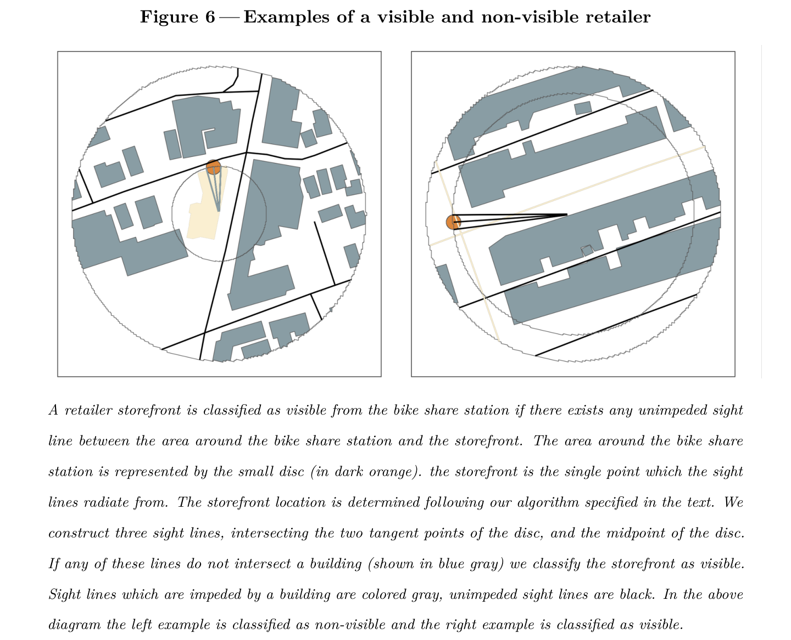

Two circular map diagrams showing building footprints (blue-gray polygons), roadways (black lines), a bike share station padding disc (small dark orange disc), and sight lines radiating from a storefront point. In the left panel the station sits around the side of the building relative to the storefront and all three sight lines are impeded by buildings (colored gray), so the retailer is classified as non-visible despite its proximity. In the right panel the sight lines from the storefront to the station disc are unimpeded (drawn in black), so the retailer is classified as visible. Original figure note: "A retailer storefront is classified as visible from the bike share station if there exists any unimpeded sight line between the area around the bike share station and the storefront. The area around the bike share station is represented by the small disc (in dark orange). the storefront is the single point which the sight lines radiate from. The storefront location is determined following our algorithm specified in the text. We construct three sight lines, intersecting the two tangent points of the disc, and the midpoint of the disc. If any of these lines do not intersect a building (shown in blue gray) we classify the storefront as visible. Sight lines which are impeded by a building are colored gray, unimpeded sight lines are black. In the above diagram the left example is classified as non-visible and the right example is classified as visible."

Figure 6 shows two examples of retailers which are visible and not visible from the bike share station. The left panel shows a retailer where the bike station is located around the side of the building where the sight line is obstructed. Although the station is close to the storefront, it is not visible for riders who have completed their trip. The right panel shows a visible retailer where there are unimpeded sight lines from the storefront to the station.

Retailers are then classified into one of three groups; Visible Storefronts, Non-visible Storefronts, and Untreated Storefronts. The first being visible from a bike share station, as shown in the right panel. The second being within a 100 meters proximity of the bike share station, but not visible, as shown in the left panel. The third group are retailers outside of a 120 meters radius of any bike share station; the additional 20 meters is added to be conservative with firms that are on the margin of being inside the 100 meters threshold. These are retailers which are not treated are eligible to be used as controls for the treated retailers. Importantly, the control firms must have never been treated by a bike station, which includes prior to the sample period of 2018. Any retailer which was treated prior to 2018 is dropped from the sample.

After completing the storefront visibility classification algorithm, each retailer was manually checked for the following edge cases: (1) when the retailer is located on a street corner and there may be two visible sides to the building, (2) whether the building footprint has overhanging features which are not representative of the building's walls, (3) whether the storefront is not on the same street as the retailer's street address.[^14]

[^14]: The visibility verification process was completed by rendering a map of the storefront classification for each impacted retailer by a bike share station. For any of the classifications which may fall into one of the three issues described above, the classification was verified and updated using Google Street View.

### 4.2 Matching retailers

To isolate the treatment effect from other unobserved factors which may be occurring during the bike share expansions, we identify the most similar retailer not impacted by the bike share expansion. We do this with coarsened propensity score matching. For each city, we restrict the control firms to be located within a 1000 meter radius of the exterior hull of bike stations. This is done so that control firms are likely to face similar non-bike station demand shocks as the treated stations. As mentioned above, we remove all retailers within 120 meters of a pre-existing bike share station. This is done to ensure that no firms used in the analysis are experiencing effects from being treated prior to the sample. The area we are left with for candidate nearest-neighbor control retailers is shown in Figure 7, where pretreated areas are "punched" out of the shaded area on the maps of both cities.

**Table 1. Summary statistics**

|  | Visible Retailers | Non-Visible Retailers | Control Retailers |
|---|---|---|---|
| **Monthly Retailer Visits** |  |  |  |
| Mean | 262.99 | 256.32 | 294.51 |
| 10th Percentile | 29 | 32 | 33 |
| Median | 183 | 183 | 220 |
| 90th Percentile | 2400 | 2009 | 2384 |
| SD | 277.26 | 248.46 | 271.19 |
| Number of Firms | 356 | 201 | 557 |
| Number of Observations | 8544 | 4824 | 13368 |

**Figure 7. Eligible area of analysis after removing areas treated before 2018**

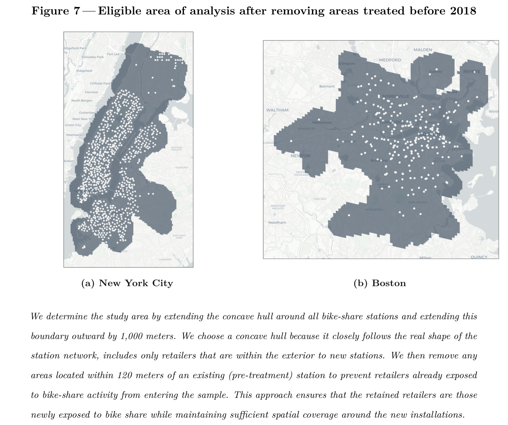

Two maps — panel (a) New York City and panel (b) Boston — showing the eligible study area as a large dark-gray shaded region with many small white circular holes punched out where pre-2018 bike share stations existed. In NYC the punched-out holes densely cover Manhattan and western Brooklyn, leaving the shaded eligible area mostly in outer areas; in Boston the holes are scattered through the central Boston/Cambridge/Somerville core with the eligible area extending outward toward Waltham, Newton, Malden, and Quincy. Original figure note: "We determine the study area by extending the concave hull around all bike-share stations and extending this boundary outward by 1,000 meters. We choose a concave hull because it closely follows the real shape of the station network, includes only retailers that are within the exterior to new stations. We then remove any areas located within 120 meters of an existing (pre-treatment) station to prevent retailers already exposed to bike-share activity from entering the sample. This approach ensures that the retained retailers are those newly exposed to bike share while maintaining sufficient spatial coverage around the new installations."

We find the nearest neighbor to a treated retailer with coarsened propensity score matching.[^15] Matches are restricted to share the same retailer category group. We define the retailer groupings which we match on by the NAICS codes as presented in Table 2. In addition, if the treated retailer is part of a franchise or chain with multiple locations, we perform exact matching on the location name (i.e. McDonalds matched to a McDonalds, Starbucks matched to a Starbucks). Exact matching on the retailer group, and location name get us the set of candidate matches for each treated retailer. From this set, we select the control firm which has the closest propensity score when estimated on the average store visits in the three months leading up to treatment, and the location of each firm.[^16]

[^15]: The nearest-neighbor coarsened propensity score matching process is completed using the {MatchIt} package in R (Ho et al. 2007).

[^16]: We perform the matching on a group-time basis where groups are defined by their first period of being treated. This allows for computing the pseudo-monthly visits for the three months leading up to the month which the cohort group is treated for all the control firms.

Of the total set of 1,452 places which are located in the eligible areas of Boston and NYC, 1,440 were matched. Of these 1,440 matched places, we removed those which had monthly visits falling above the 99th percentile of what is observed in our data, primarily sports stadiums, grocery stores, and parks. We also removed others that are not retailers, for example schools and airports. This leaves a final dataset of 840 treated retailers. We then remove the set of retailers which we observe to not be active during the entire sample.[^17] This leaves us with a sample of 557 retailers. The summary statistics for the matched dataset are shown in Table 1. The average retailer has around 260 store visits per month.

[^17]: We infer whether a store was not present in their location throughout the entire sample by using images collected from Google Street View's "see more dates" feature, which allows us to see archival versions of the storefront. A retailer was determined to not be in its location if the Google Street View image showed a different retailer, or vacant property any time between 2018 and 2019.

## 5 Results

We begin by presenting descriptive evidence to motivate our empirical design. Figure 8 plots average monthly visits for treated and control retailers in event time. We assign control firms the treatment dates of their treated nearest neighbor firm. Panel (a) presents the raw averages. While treated retailers appear to have higher visits before treatment and lower visits afterwards, these trends are confounded by the sample composition changing over time. Larger, more frequently visited firms tend to be treated later in the sample and lead to an overall decline in visits. This change in composition and treatment effect size over time further suggests the need for the Callaway and Sant'Anna (2021) estimator to handle heterogeneous treatment effects across time. Panel (b) de-means visits at the firm level by subtracting each retailer's preperiod average monthly visits. Once standardized, treated and control retailers show parallel trends prior to treatment and diverge after bike share station openings, highlighting a gain from increased passerby traffic.

**Table 2. Retailer category mapping rules**

| Retailer Category | NAICS Codes / Naming Rule |
|---|---|
| Coffee | 722515; location name contains "coffee", "dunkin", "starbucks", or "cafe" |
| Convenience | 447110 |
| Grocery | 445110, 445120, 452311, 452319 |
| Miscellaneous | 453210, 453220, 453910, 453991, 453998 |
| Fast Food Restaurant | 722513 |
| Full-Service Restaurants | 722511 |
| Retail | 441310, 441320, 442110, 442210, 443142, 445210, 445291, 445292, 445299, 445310, 446110, 446120, 446130, 446191, 446199, 448110, 448120, 448130, 448140, 448150, 448190, 448210, 448310, 451110, 451120, 451211, 452210, 453310, 811111, 811118, 811121, 811191, 811192, 811198 |

**Figure 8. Average monthly visits in event-time**

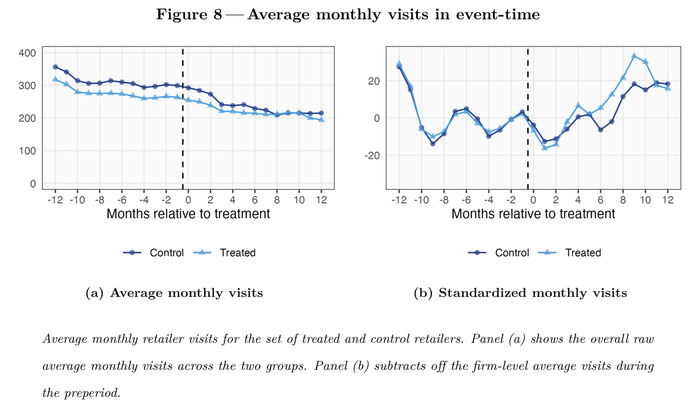

Two line panels plotting average monthly retailer visits for treated (light blue) and control (dark navy) retailers over event time from -12 to +12 months, with a dashed vertical line at treatment. Panel (a), raw averages: both series decline over event time from roughly 300–360 visits at month -12 to roughly 200 visits at month +12, with control retailers sitting slightly above treated retailers for most of the window. Panel (b), standardized (firm-level de-meaned) visits on a roughly -20 to +30 scale: treated and control series track each other closely before treatment, then the treated series rises above the control series after treatment, peaking around months +9 to +10. Original figure note: "Average monthly retailer visits for the set of treated and control retailers. Panel (a) shows the overall raw average monthly visits across the two groups. Panel (b) subtracts off the firm-level average visits during the preperiod."

### 5.1 Bike share station openings and retail traffic

Following Callaway and Sant'Anna (2021), we estimate the group-time average treatment on the treated. We follow the notation used in the literature. For units first treated in period $g$, the group-time ATT at time $t \geq g$ is defined as,

$$ATT(g,t) = \mathbb{E}\left[Y_t(1) - Y_t(0) \mid G = g\right],$$

where $Y_t(1)$ and $Y_t(0)$ denote potential outcomes with and without treatment, and $G = g$ is the cohort first treated in period $g$. To summarize effects over time and groups, we aggregate these group-time treatment effects into an overall dynamic ATT,

$$ATT(t) = \sum_{g \leq t} w_g \cdot ATT(g,t),$$

where $w_g$ are weights reflecting the relative size of each cohort. Our dynamic ATT estimates allow us to trace out the treatment effects relative to the treatment period, similar to an event-study.

We also report a static (overall) ATT by aggregating group-time effects:

$$ATT = \sum_g \sum_{t \geq g} \omega_{g,t}\, ATT(g,t), \qquad \omega_{g,t} \geq 0,\ \sum_g \sum_{t \geq g} \omega_{g,t} = 1,$$

where $\omega_{g,t}$ are aggregation weights (e.g., observation-weighted by cohort size and exposure time). The static estimates are interpretable as the overall average treatment on the treated coefficient in the post period, accounting for the staggered adoption.[^18]

[^18]: We implement the estimator and construct the dynamic and static ATT coefficients using the {did} R package (Callaway and Sant'Anna 2021).

The main effects are shown in Table 3, which are the group-time ATT aggregated across post periods using our never-treated matched retailers as controls. We find that retailers which are within 100 meters of a bike share station see an additional 9.94 monthly visits following the expansion of a bike share station.[^19] This effect is larger for the subset of retailers which have storefronts visible from the bike share station. We fail to find any statistical evidence of an effect for non-visible storefronts. This provides two findings. Retailers do benefit from the increased passerby traffic brought by bike share stations, and that the lift appears to be going to retailers whose storefronts are visible from the bike share station.

[^19]: As is standard with this method, we do not report a goodness of fit measure as the group-time estimators are a weighted average different regression models for each cohort.

**Table 3. Static main model coefficients**

| term | Overall Effect | Visible Storefront | Non-Visible Storefront |
|---|---|---|---|
| treatPost | 9.94\*\*\* (3.85) | 11.55\*\* (5.35) | 5.60 (5.47) |

Notes: \*p < 0.1; \*\*p < 0.05; \*\*\*p < 0.01. SE in parentheses. Static coefficients shown applying the Callaway and Sant'Anna (2021) static aggregation method.

We then look to the dynamics felt by retailers in the months following the bike share expansion. This is shown in Figure 9 with the Callaway and Sant'Anna (2021) aggregated group-time dynamic event study coefficients. The pre-treatment coefficients are small and statistically indistinguishable from zero, supporting the no-anticipation and parallel trends assumptions.

Positive coefficients begin to emerge at four months after station openings and reach their peak (and statistical significance) at six months where they are stable through twelve months. At twelve months after the station opens, treated retailers experience approximately 21 additional monthly visits, representing an 8% increase relative to pre-treatment means.[^20]

[^20]: With an $\widehat{ATT}^{ES}(6) = 20.83$ we divide by the average number of visits for treated retailers, 260.58, to get a 7.99% increase.

**Figure 9. Retail lift in monthly retail visits following entry of bike share stations**

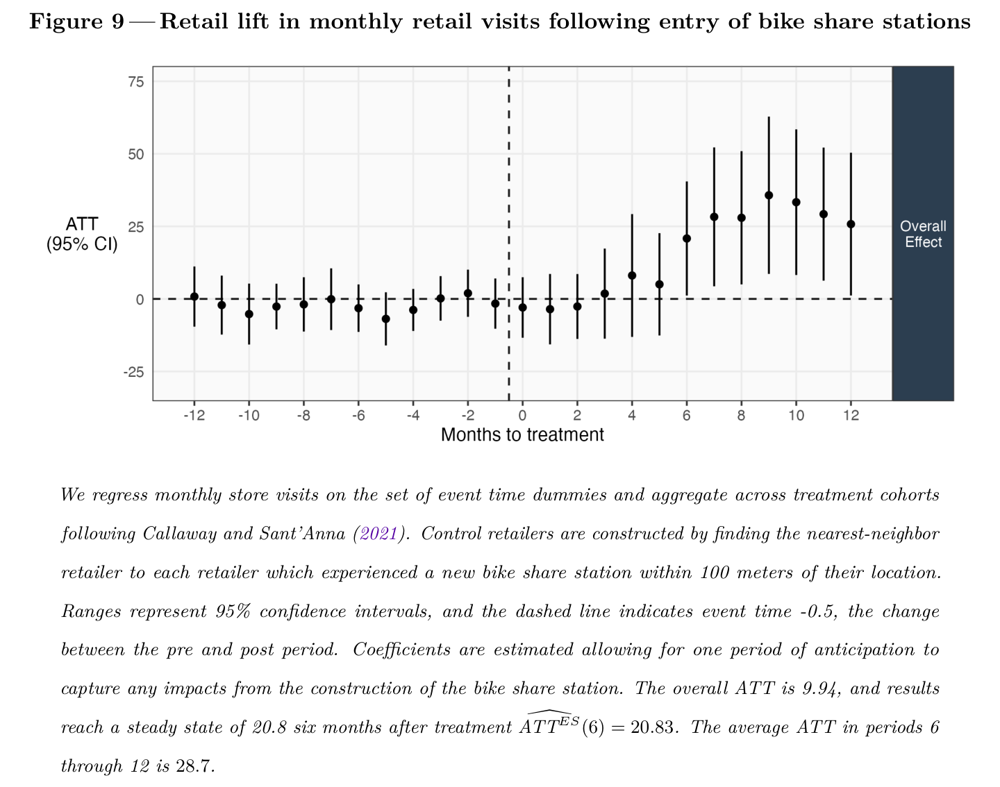

An event-study plot of ATT point estimates with 95% confidence intervals for months -12 to +12 relative to treatment, with a dashed vertical line at event time -0.5 and a side panel labeled "Overall Effect". Pre-treatment coefficients hover near zero (roughly between -10 and +5) with confidence intervals covering zero. Post-treatment coefficients turn positive around month +4, rising to roughly 20–35 additional monthly visits between months +6 and +12, with confidence intervals excluding zero for most of that range. Original figure note: "We regress monthly store visits on the set of event time dummies and aggregate across treatment cohorts following Callaway and Sant'Anna (2021). Control retailers are constructed by finding the nearest-neighbor retailer to each retailer which experienced a new bike share station within 100 meters of their location. Ranges represent 95% confidence intervals, and the dashed line indicates event time -0.5, the change between the pre and post period. Coefficients are estimated allowing for one period of anticipation to capture any impacts from the construction of the bike share station. The overall ATT is 9.94, and results reach a steady state of 20.8 six months after treatment $\widehat{ATT}^{ES}(6) = 20.83$. The average ATT in periods 6 through 12 is 28.7."

We explored why it takes six months for our estimates to reach their steady-state. The temporal pattern of these effects closely mirrors the adoption curve of bike share ridership. We estimate the average trips taken per month following a station's opening for all stations which provide the treatments to the retailers in our sample, using the following regression for each station $i$ in month $t$ with month-year fixed effects $\gamma_t$:

$$\text{Monthly bike trips}_{it} = \sum_{k=0}^{12} \beta^k D_{k(i,t)} + \gamma_t + \varepsilon_{it} \tag{1}$$

This is the regression analogue to taking the average number of trips per station in event-time while controlling for seasonality with the month-year fixed effects. The coefficients $\beta^k$ trace out the dynamics in which users begin using the new bike share stations. In Figure 10 below, we observe that it takes up to six months before a new station reaches its peak popularity on average. This trend may be driven by the time required for the stations to be observed by bike share users, and also due to seasonality, in which stations which are placed in the summer and fall do not become well-visited until the following spring as ridership falls in the winter months. With the majority of stations sited in the summer and fall months, we get this overall trend where visits on average take five to six months to reach their steady state, reinforcing the interpretation that increased passerby flows mediate the retail demand spillovers.

**Figure 10. Average monthly completed bike share trips relative to station open**

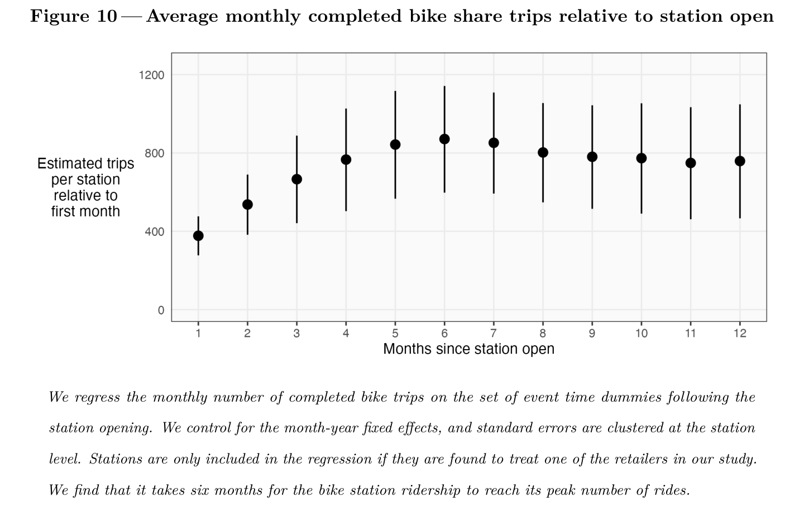

A point-range plot of estimated monthly bike trips per station (relative to the first month) for months 1 through 12 since station opening, with confidence interval bars. Estimated trips rise from roughly 380 in month 1 and about 540 in month 2 to a peak of roughly 850–870 around months 5–7, then remain roughly flat near 750–800 through month 12. Original figure note: "We regress the monthly number of completed bike trips on the set of event time dummies following the station opening. We control for the month-year fixed effects, and standard errors are clustered at the station level. Stations are only included in the regression if they are found to treat one of the retailers in our study. We find that it takes six months for the bike station ridership to reach its peak number of rides."

### 5.2 The role of storefront visibility

Our central research question is whether retailers benefit merely from being located near new passerby traffic, or whether they must also be visible from that traffic. Figure 11 splits treated retailers by whether the storefront is visible or not from the bike share station. We find strong evidence that retailers which are visible to the passerby traffic contribute almost the entire main effect. Taking into account the dynamics, the average ATT for visible firms settles at 26.5, which is 10.08% above the average visits for treated visible firms, and 10.8 for non-visible retailers, which is 4.2% above the average visits for the treated non-visible firms.[^21] In the visible-storefront sample, we observe a distinct dip in visits in the period preceding station installation, consistent with construction temporarily impeding access. This pattern is not evident among non-visible storefronts. This decline is also consistent with a central role of visibility, as these locations are by definition positioned along the sightlines where bike-share stations and associated construction activity would most directly affect traffic if visibility played a central role.

[^21]: Calculated as $\widehat{ATT}^{V}(6) = 26.5/262.99 = 0.1008$, $\widehat{ATT}^{NV}(6) = 10.77/256.32 = 0.042$.

**Figure 11. Visible and non-visible retail lift in monthly retail visits following entry of bike share stations**

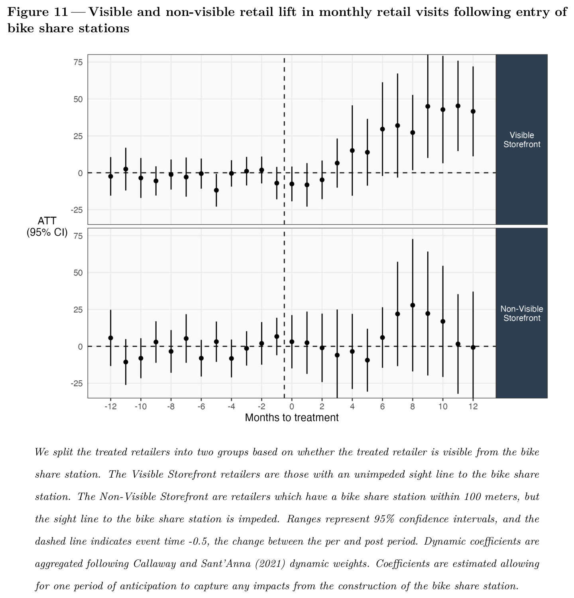

A two-panel event-study plot (months -12 to +12, ATT with 95% confidence intervals, dashed vertical line at event time -0.5). The top panel, "Visible Storefront," shows pre-treatment coefficients near zero, a dip in the periods just before installation (roughly -10 at event times -1 and 0), and a clear rise after treatment to roughly 30–45 additional monthly visits between months +6 and +12, with several post-period intervals excluding zero. The bottom panel, "Non-Visible Storefront," shows coefficients fluctuating around zero both before and after treatment, with a modest, imprecisely estimated rise around months +7 to +9 (roughly +20 to +28) that returns to near zero by month +12. Original figure note: "We split the treated retailers into two groups based on whether the treated retailer is visible from the bike share station. The Visible Storefront retailers are those with an unimpeded sight line to the bike share station. The Non-Visible Storefront are retailers which have a bike share station within 100 meters, but the sight line to the bike share station is impeded. Ranges represent 95% confidence intervals, and the dashed line indicates event time -0.5, the change between the per and post period. Dynamic coefficients are aggregated following Callaway and Sant'Anna (2021) dynamic weights. Coefficients are estimated allowing for one period of anticipation to capture any impacts from the construction of the bike share station."

In the online appendix, we document robustness to alternative group time estimators including Borusyak, Jaravel, and Spiess (2021), Gardner (2022), Roth and Sant'Anna (2023), and Sun and Abraham (2021).[^22] One concern is that the set of treated retailers are different from the set of control retailers. We first use coarsened propensity score matching to find the nearest twin retailer to each treated firm. In addition, we repeat the analysis using the not-yet-treated retailers as controls. This specification rules out any unobserved differences in the treated and control retailers which could be driving the results, as all the not-yet-treated retailers do receive treatment. Finally, we show the set of results using retailers which were found to have entered, exited, or were never in the location during our sample period. Our main analysis removes these firms, however we reach similar economic takeaways when we keep these firms in the sample. Statistically, these estimates are attenuated which we believe to be due to the fact that firms which were not present are unable to absorb any of the increase in passerby traffic.

[^22]: We leverage the {did2s} R package (Butts 2021) to run the alternative group-time estimators.

Visibility is likely correlated with distance. Therefore, it is possible that the results described above are not driven by the the sight lines but simply being closer to the station which leads to an increase in visits. In Figure 12 we show the event study ATTs for different distance thresholds, showing within each distance category, the visible retailers out perform the non-visible retailers.

**Figure 12. Visible and non-visible retail lift in monthly retail visits following entry of bike share stations by distance group**

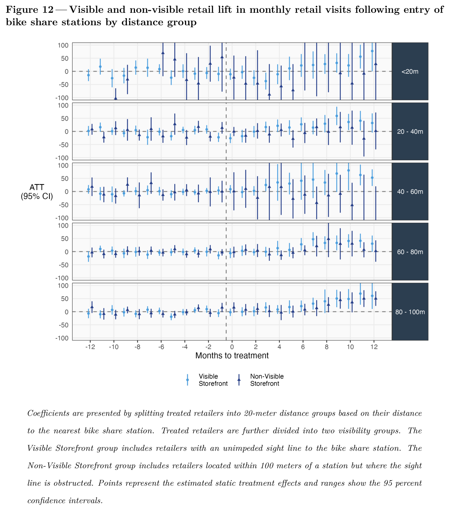

A five-panel event-study plot stacked by distance band (<20m, 20–40m, 40–60m, 60–80m, 80–100m), each showing ATT point estimates with 95% confidence intervals for visible (light blue) and non-visible (dark navy) storefronts over months -12 to +12; the y-axis spans -100 to +100. Within each distance band, post-treatment estimates for visible storefronts tend to lie above those for non-visible storefronts, most clearly in the 60–80m and 80–100m bands where visible-storefront estimates rise to roughly +25 to +75 after treatment while non-visible estimates remain near zero. Confidence intervals are wide, particularly in the <20m band. Original figure note: "Coefficients are presented by splitting treated retailers into 20-meter distance groups based on their distance to the nearest bike share station. Treated retailers are further divided into two visibility groups. The Visible Storefront group includes retailers with an unimpeded sight line to the bike share station. The Non-Visible Storefront group includes retailers located within 100 meters of a station but where the sight line is obstructed. Points represent the estimated static treatment effects and ranges show the 95 percent confidence intervals."

### 5.3 Visual features of storefronts and store visits

Our main results show that the lift felt by retailers are driven by the firms which have an unimpeded sight line to the bike share station. In order to support our proposed mechanism that it is visibility per se that causes the increase in store traffic, we next look at specific features of storefront signage.

While academic research on the importance of storefront signage has been described as scarce (see, e.g., Lecointre-Erickson et al. (2024) and Pantano, Priporas, and Foroudi (2019)), it is widely regarded as critical in industry reports. Best-practice guidelines emphasize that signage must be clean and well-maintained, as cluttered or dirty signs reduce consumer trust and can even deter store entry (International Council of Shopping Centers 2019). Signs must also be easy to read, using large fonts, strong contrast, and adequate lighting to ensure legibility from a distance (Humble Sign Co. 2021). Effective signage should be informative to the consumer, clearly communicating what the store offers and aligning with consumer expectations, so that passersby can make quick decisions about whether to enter (Explorer Research 2020; LSI Industries 2020). Finally, in the context of restaurants, but also likely applicable to retailers more generally, the area outside the storefront should be kept clean to make the area inviting to potential customers Brown (2003).

Observed consumer choices reveal preferences for different storefront features. We test how well these features work at converting passerby traffic into store visits by using the variation in passerby traffic from the bike share expansions. This analysis informs the broader service scapes literature (Bitner 1992) in addition to our primary goal of assessing the impact of visibility, rather than proximity, in causing store traffic.

We collect the following features: (1) whether the storefront is informative and easy to see; (2) whether the font used is readable; and (3) whether the storefront is kept clean.[^23]

[^23]: We also collected the storefront color, whether the storefront contains graffiti, is behind scaffolding, whether the retailer is a corner store, and the number of adjacent retailers. We did not find significance across these additional visibility features. For scaffolding and graffiti we did not come across enough variation within the sample.

Storefront images were hand collected from Google Maps and classified for containing specific features by two trained research assistants. Retailers with uninformative storefronts appear in about 25% of cases, and difficult-to-read fonts in 16%. Storefronts which are not kept clean appear in 10% of cases. Examples of storefronts with each of the categorized features are shown in Figure 13.

**Figure 13. Storefront visibility feature examples**

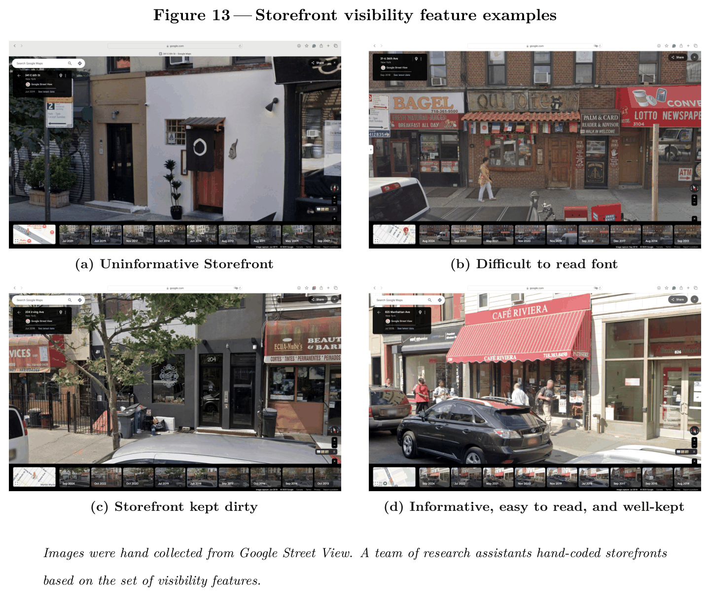

Four Google Street View screenshots illustrating the hand-coded storefront features: (a) "Uninformative Storefront" — a storefront with no legible signage indicating what the business is; (b) "Difficult to read font" — a bagel/convenience storefront with cluttered, hard-to-read signage; (c) "Storefront kept dirty" — a storefront with trash bags and clutter on the sidewalk outside; (d) "Informative, easy to read, and well-kept" — a cafe ("Cafe Riviera") with a clean red awning and clearly legible name. Original figure note: "Images were hand collected from Google Street View. A team of research assistants hand-coded storefronts based on the set of visibility features."

We estimate the impact of each storefront feature independently by slicing the data to include only firms which are coded to have that feature. We note that while it seems intuitive to include visibility interaction terms with the difference-in-differences coefficient, we follow the recent staggered difference-in-difference textbook by Chaisemartin and D'Haultfœuille (2025) as discussed in Section 6.4.1 with regards to estimating a heterogeneous ATT function.

> "With variation in treatment timing, under Assumptions NA (No anticipation) and PT (parallel trends) each stratum-specific TWFE regression estimates a weighted sum of effects among the stratum's treated groups, with weights that sum to one but may be negative. If some weights are negative, one could have, say, that all groups in stratum 1 have a larger treatment effect than all groups in stratum 2, and yet the expectation of the TWFE coefficient in stratum 1 is smaller than that in stratum 2" (Chaisemartin and D'Haultfœuille 2025, p. 234).

Interacting TWFE with storefront features would not provide interpretable heterogeneous effects in a staggered adoption setting, since strata estimates may be biased by negative weights. Our approach of estimating feature-specific effects separately avoids this issue. This is also the recommendation by Baker et al. (2025) in their recent difference-in-difference practitioner's guide. A parallel strand of research develops machine learning estimators that directly recover the function mapping covariates to heterogeneous treatment effects in DiD designs, see Hatamyar et al. (2023), but we leave this to future work.

**Figure 14. Visibility feature coefficients**

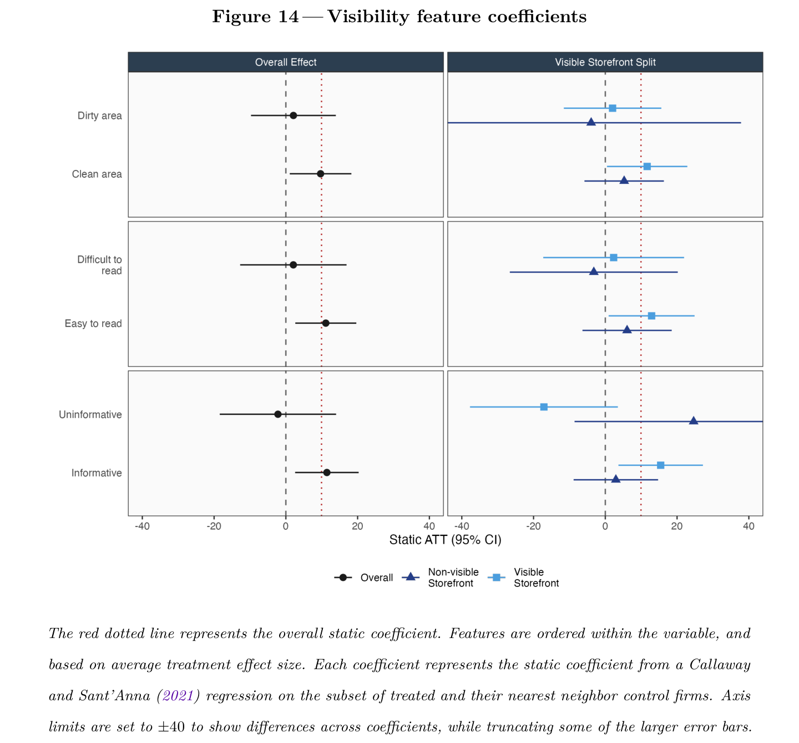

A two-column coefficient plot of static ATT estimates with 95% confidence intervals (x-axis from -40 to +40), organized in three feature pairs: Dirty area vs. Clean area, Difficult to read vs. Easy to read, and Uninformative vs. Informative. The left column ("Overall Effect", black circles) shows positive estimates of roughly +10 for Clean area, Easy to read, and Informative storefronts (near the overall-ATT red dotted line at 9.94), while Dirty area, Difficult to read, and Uninformative estimates sit near zero or slightly negative with wide intervals covering zero. The right column ("Visible Storefront Split") plots visible (light blue squares) and non-visible (dark navy triangles) subgroups: visible storefronts with positive features (clean, easy to read, informative) show estimates around +10 to +15, while the visible-uninformative estimate is strongly negative (about -17) and the non-visible-uninformative estimate is large and positive (roughly +25) with a very wide interval. Original figure note: "The red dotted line represents the overall static coefficient. Features are ordered within the variable, and based on average treatment effect size. Each coefficient represents the static coefficient from a Callaway and Sant'Anna (2021) regression on the subset of treated and their nearest neighbor control firms. Axis limits are set to ±40 to show differences across coefficients, while truncating some of the larger error bars."

Shown in Figure 14, we estimate Callaway and Sant'Anna (2021) on each subset of firms and aggregate the coefficients to the static ATT. The red dashed line shows the overall ATT as a baseline. Coefficients are best interpreted relative to the average treatment effect on the treated within the visibility measure of their group, meaning coefficients to the left of the red dashed line are under-performing relative to the average treated firm.

Figure 14 documents that storefronts which are dirty, have difficult to read, or uninformative signs, do not appear to increase store traffic overall. When we split the effects across visible and non-visible retailers, we find that the effects are stronger for the features which convey information when the storefront is visible, though results are not statistically significantly different from each other.

The overall patterns suggest visible storefronts are more likely to increase store traffic when they are high quality, as defined by a clean area with an easy to read or an informative sign. One coefficient however, is negative, large, and of marginal significance suggesting that visible uninformative retails signs may have a negative effect on traffic (b = -17.11, se=10.51, t = 1.63). Firms in this group may be made worse off from the bike share stations, perhaps because their usual consumers are being impacted from the increased congestion brought forward from the bike share stations.

Taken together, our results suggest that there is a vital role in the storefront's ability to communicate information to the potential consumer. When it comes to capitalizing on new passersby, it is the retailers which are able to communicate information about their store (as defined by cleanliness, sign readability, and sign information) which are the ones who are able to draw in the consumers. We interpret this to suggest that the storefront serves a marketing communications role that provides a key mechanism underlying the literature's emphasis on proximity.

## 6 Conclusion

The retailer location literature emphasizes the role of proximity in driving store traffic. Using plausibly exogenous variation in passerby traffic from new bikeshare stations and combining store-traffic data with street-level maps to calculate sightlines, we show that visibility helps explain the proximity effect. This suggests that the link between high-traffic locations and store visits is not solely about reduced proximity and increasing ease of access, but about observability in the sense highlighted by Rogers (2003) and Bollinger et al. (2022). The storefront's visual presence acts as a marketing communications channel.

To causally isolate the effect of observability, we use a staggered difference-in-differences design, using a shock to passerby traffic created by the expansion bike share networks in New York and Boston. We link station installation timing with high-frequency mobile data and measure store exposure via precise line-of-sight analysis. Our main estimates find retailers with clear visibility to the new stations experienced a significant and economically meaningful increase in foot traffic. To support the claim that this is related to marketing communications, we document that this effect is driven by informative signage, legible fonts, and well-kept storefronts.

We encourage readers to be cautious in generalizing from our results. We measure the impact of a plausibly exogenous increase in foot traffic near retail stores as a result of new bike share stations in two large U.S. cities. As such, we demonstrate that visibility matters in a particular case. We do not claim that visibility matters more than proximity in other cases, such as when traffic patterns are regular or foot traffic is rare. Thus, the findings should be interpreted as suggesting that visibility affects store traffic in certain situations, rather than suggesting broader external validity claims that visibility explains all or most of the proximity effects documented elsewhere.

Our results do suggest that store visibility is an important aspect of marketing communications. While this has been implied in textbooks (Levy et al. 2004), research on store location has nevertheless emphasized proximity. Store location is considered a 'place' or distribution decision. We see our results as a rigorously documented reminder of the interaction between distribution and marketing communications, as defined by the visibility and features of the storefront.

## Declarations

**Funding and competing interests.** All authors certify that they have no affiliations with or involvement in any organization or entity with any financial interest or non-financial interest in the subject matter or materials discussed in this manuscript. Research funded by government and university grants.

## References

- Aguirregabiria, Victor, and Junichi Suzuki. 2016. "Empirical games of market entry and spatial competition in retail industries." In *Handbook on the Economics of Retailing and Distribution*, 201–232. Edward Elgar Publishing.
- Applebaum, William. 1965. "Can store location research be a science?" *Economic Geography* 41 (3): 234–237.
- Applebaum, William. 1966. "Methods for determining store trade areas, market penetration, and potential sales." *Journal of Marketing Research* 3 (2): 127–141.
- Applebaum, William, Curt Kornblau, et al. 1968. "Guide to store location research: With emphasis on super markets." Reading, Mass.: Addison-Wesley.
- Athey, Susan, David Blei, Robert Donnelly, Francisco Ruiz, and Tobias Schmidt. 2018. "Estimating heterogeneous consumer preferences for restaurants and travel time using mobile location data." In *AEA Papers and Proceedings*, 108:64–67.
- Babar, Yash, and Gordon Burtch. 2024. "Recharging retail: Estimating consumer demand spillovers from electric vehicle charging stations." *Manufacturing & Service Operations Management* 26 (3): 797–813.
- Baker, Andrew, Brantly Callaway, Scott Cunningham, Andrew Goodman-Bacon, and Pedro HC Sant'Anna. 2025. "Difference-in-differences designs: A practitioner's guide." *arXiv preprint arXiv:2503.13323*.
- Baker, Julie, Dhruv Grewal, and Ananthanarayanan Parasuraman. 1994. "The influence of store environment on quality inferences and store image." *Journal of the Academy of Marketing Science* 22 (4): 328–339.
- Baker, Julie, Albert Parasuraman, Dhruv Grewal, and Glenn B Voss. 2002. "The influence of multiple store environment cues on perceived merchandise value and patronage intentions." *Journal of Marketing* 66 (2): 120–141.
- Banerjee, Abhijit V. 1992. "A simple model of herd behavior." *The Quarterly Journal of Economics* 107 (3): 797–817.
- Bikhchandani, Sushil, David Hirshleifer, and Ivo Welch. 1992. "A theory of fads, fashion, custom, and cultural change as informational cascades." *Journal of Political Economy* 100 (5): 992–1026.
- Bitner, Mary Jo. 1992. "Servicescapes: The impact of physical surroundings on customers and employees." *Journal of Marketing* 56 (2): 57–71.
- Bluebikes / Lyft, Inc. 2025. *System Data — Bluebikes*. https://bluebikes.com/system-data.
- Bollinger, Bryan, Jesse Burkhardt, and Kenneth T Gillingham. 2020. "Peer effects in residential water conservation: Evidence from migration." *American Economic Journal: Economic Policy* 12 (3): 107–133.
- Bollinger, Bryan, Kenneth Gillingham, A Justin Kirkpatrick, and Steven Sexton. 2022. "Visibility and peer influence in durable good adoption." *Marketing Science* 41 (3): 453–476.
- Borusyak, Kirill, Xavier Jaravel, and Jann Spiess. 2021. "Revisiting event study designs: Robust and efficient estimation." *arXiv preprint arXiv:2108.12419*.
- Bowes, David R, and Keith R Ihlanfeldt. 2001. "Identifying the impacts of rail transit stations on residential property values." *Journal of Urban Economics* 50 (1): 1–25.
- Brown, Douglas Robert. 2003. *The restaurant manager's handbook: How to set up, operate, and manage a financially successful food service operation*. Vol. 1. Atlantic Publishing Company.
- Butts, Kyle. 2021. *did2s: Two-Stage Difference-in-Differences Following Gardner (2021)*. https://github.com/kylebutts/did2s/.
- Callaway, Brantly, and Pedro H.C. Sant'Anna. 2021. *did: Difference in Differences*. R package version 2.1.2. https://bcallaway11.github.io/did/.
- Callaway, Brantly, and Pedro HC Sant'Anna. 2021. "Difference-in-differences with multiple time periods." *Journal of Econometrics* 225 (2): 200–230.
- Chaisemartin, Clement de, and Xavier D'Haultfœuille. 2025. "Credible answers to hard questions: differences-in-differences for natural experiments." *Available at SSRN 4487202*.
- Chan, Tat Y, Jia Li, and Lamar Pierce. 2014. "Learning from peers: Knowledge transfer and sales force productivity growth." *Marketing Science* 33 (4): 463–484.
- Citi Bike / Lyft, Inc. 2025. *System Data — Citi Bike*. https://citibikenyc.com/system-data.
- City of Boston Analytics Team. 2024. "Bluebike Station Siting Project Summary." Accessed August 11, 2025. https://www.boston.gov/departments/analytics-team/bluebike-station-siting-project-summary.
- Cornelius, Britta, Martin Natter, and Corinne Faure. 2010. "How storefront displays influence retail store image." *Journal of Retailing and Consumer Services* 17 (2): 143–151.
- Davis, Peter. 2006. "Spatial competition in retail markets: movie theaters." *The RAND Journal of Economics* 37 (4): 964–982.
- Explorer Research. 2020. *How to Optimize Signage Placement*. Accessed: 2025-08-31. https://explorerresearch.com/how-to-optimize-signage-placement/.
- Gardete, Pedro M. 2015. "Social effects in the in-flight marketplace: Characterization and managerial implications." *Journal of Marketing Research* 52 (3): 360–374.
- Gardner, John. 2022. "Two-stage differences in differences." *arXiv preprint arXiv:2207.05943*.
- Goodman-Bacon, Andrew. 2021. "Difference-in-differences with variation in treatment timing." *Journal of Econometrics* 225 (2): 254–277.
- Gorback, Caitlin. 2020. *Ridesharing and the redistribution of economic activity*. Technical report. Working Paper.
- Gupta, Arpit, Stijn Van Nieuwerburgh, and Constantine Kontokosta. 2022. "Take the Q train: Value capture of public infrastructure projects." *Journal of Urban Economics* 129.
- Hatamyar, Christopher, Noémi Kreif, Raphael Rocha, and Martin Huber. 2023. "Heterogeneous treatment effects in difference-in-differences with variation in treatment timing." *arXiv preprint arXiv:2305.19249*.
- Ho, Daniel E, Kosuke Imai, Gary King, and Elizabeth A Stuart. 2007. "Matching as nonparametric preprocessing for reducing model dependence in parametric causal inference." *Political Analysis* 15 (3): 199–236.
- Hotelling, Harold. 1929. "Stability in Competition." *The Economic Journal* 39 (153): 41–57.
- Hou, Young, Christopher Poliquin, Mariko Sakakibara, and Marco Testoni. 2025. "Using Smartphone Location Data for Strategy Research." *Strategy Science*.
- Huff, David L. 1962. "A note on the limitations of intraurban gravity models." *Land Economics* 38 (1): 64–66.
- Huff, David L. 1964. "Defining and estimating a trading area." *Journal of Marketing* 28 (3): 34–38.
- Humble Sign Co. 2021. *How Storefront Signage Can Attract More Customers*. Accessed: 2025-08-31. https://humblesignco.com/storefront-signage-attract-more-customers/.
- International Council of Shopping Centers. 2019. *5 Retail Signage Tips to Drive Attention and Traffic to Your Store*. Accessed: 2025-08-31. https://www.icsc.com/news-and-views/icsc-exchange/5-retail-signage-tips-to-drive-attention-and-traffic-to-your-store.
- Jia, Panle. 2008. "What happens when Wal-Mart comes to town: An empirical analysis of the discount retailing industry." *Econometrica* 76 (6): 1263–1316.
- Kabra, Ashish, Elena Belavina, and Karan Girotra. 2020. "Bike-share systems: Accessibility and availability." *Management Science* 66 (9): 3803–3824.
- Kim, Kyeongbin, and Daniel Minh McCarthy. 2024. "Wheels to meals: Measuring the impact of micromobility on restaurant demand." *Journal of Marketing Research* 61 (1): 128–142.
- Kotler, Philip. 1973. "Atmospherics as a marketing tool." *Journal of Retailing* 49 (4): 48–64.
- Lecointre-Erickson, Danielle, Safaa Adil, Bruno Daucé, and Patrick Legohérel. 2024. "The role of brick-and-mortar exterior atmospherics in post-COVID era shopping experience: a systematic review and agenda for future research." *Journal of Strategic Marketing* 32 (8): 1180–1194.
- Levy, Michael, Barton A Weitz, Dhruv Grewal, and Michael Madore. 2004. *Retailing management*. McGraw-Hill Irwin New York.
- Li, Zhenlong, Huan Ning, Fengrui Jing, and M Naser Lessani. 2024. "Understanding the bias of mobile location data across spatial scales and over time: a comprehensive analysis of SafeGraph data in the United States." *Plos one* 19 (1): e0294430.
- LSI Industries. 2020. *The Definitive Guide to Retail Signage*. Accessed: 2025-08-31. https://lsicorp.com/cbsf/the-definitive-guide-to-retail-signage/.
- Martineau, Pierre. 1958. "The personality of the retail store." *Harvard Business Review*.
- Mas, Alexandre, and Enrico Moretti. 2009. "Peers at work." *American Economic Review* 99 (1): 112–145.
- Mazursky, David, and Jacob Jacoby. 1986. "Exploring the development of store images." *Journal of Retailing*.
- McShane, Blakeley B, Eric T Bradlow, and Jonah Berger. 2012. "Visual influence and social groups." *Journal of Marketing Research* 49 (6): 854–871.
- Miyauchi, Yuhei, Kentaro Nakajima, and Stephen J Redding. 2025. "The Economics of Spatial Mobility: Theory and Evidence Using Smartphone Data." *The Quarterly Journal of Economics*. https://doi.org/10.1093/qje/qjaf038.
- Moore, Gary C, and Izak Benbasat. 1991. "Development of an instrument to measure the perceptions of adopting an information technology innovation." *Information Systems Research* 2 (3): 192–222.
- New York City Department of Transportation. 2013a. *NYC Bike Share: Designed by New Yorkers*. Technical report. New York, NY: NYC DOT. https://www.nyc.gov/html/dot/downloads/pdf/bike-share-outreach-report.pdf.
- New York City Department of Transportation. 2013b. *NYC DOT Releases Report Documenting Intensive Citi Bike Community Planning, the Most Expansive Public Process in Transportation History*. Press release #13-19, April. https://www.nyc.gov/html/dot/html/pr2013/pr13-019.shtml.
- Pantano, Eleonora, Constantinos Vasilios Priporas, and Pantea Foroudi. 2019. "Innovation starts at the storefront: Modelling consumer behaviour towards storefront windows enriched with innovative technologies." *International Journal of Retail & Distribution Management* 47 (2): 202–219.
- Pebesma, Edzer. 2018. "Simple Features for R: Standardized Support for Spatial Vector Data." *The R Journal* 10 (1): 439–446. https://doi.org/10.32614/RJ-2018-009.
- Rambachan, Ashesh, and Jonathan Roth. 2023. "A more credible approach to parallel trends." *Review of Economic Studies*, rdad018.
- Reilly, William J. 1931. *The Law of Retail Gravitation*. New York: Knickerbocker Press.
- Rogers, Everett M. 2003. "Diffusion of innovations." Free Press.
- Roth, Jonathan, and Pedro HC Sant'Anna. 2023. "Efficient estimation for staggered rollout designs." *Journal of Political Economy Microeconomics* 1 (4): 669–709.
- Sample, Kevin L, Julio Sevilla, and Kelly L Haws. 2025. "Clear views, clear gains: Exterior transparency's role in increasing consumer entry for retail environments." *Journal of Retailing*.
- Seim, Katja. 2006. "An empirical model of firm entry with endogenous product-type choices." *The RAND Journal of Economics* 37 (3): 619–640.
- Sen, Sankar, Lauren G Block, and Sucharita Chandran. 2002. "Window displays and consumer shopping decisions." *Journal of Retailing and Consumer Services* 9 (5): 277–290.
- Sun, Liyang, and Sarah Abraham. 2021. "Estimating dynamic treatment effects in event studies with heterogeneous treatment effects." *Journal of Econometrics* 225 (2): 175–199.
- Wang, Kitty, and Avi Goldfarb. 2017. "Can offline stores drive online sales?" *Journal of Marketing Research* 54 (5): 706–719.
- Wen, Muchen, Junming Liu, Natasha Zhang Foutz, and Baohong Sun. 2024. *Rethinking Conventional Wisdom: The Net Spillover Effect of Bike Sharing Entry on Restaurant Patronage*. Technical report. Working Paper.
- Yang, Yang, Lan Jiang, and Zili Zhang. 2021. "Tourists on shared bikes: Can bike-sharing boost attraction demand?" *Tourism Management* 86:104328.

## Appendix

(summarized) This PDF contains no appendix; the manuscript ends with the references on page 41. Robustness analyses referenced in the text — alternative group-time estimators (TWFE, Borusyak-Jaravel-Spiess, Gardner, Roth-Sant'Anna, Sun-Abraham), results using not-yet-treated retailers as controls, and results including retailers that entered, exited, or were never present during the sample — are reported in a separate online appendix that is not part of this document.
