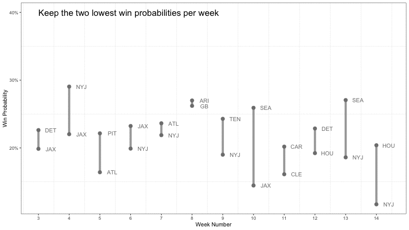

<style type="text/css">
   .main-container {max-width: 50%;}
   .row {display: flex;}
   .column {flex: 50%;}
</style>

```{r setup, include=FALSE}
knitr::opts_chunk$set(echo = TRUE, 
                      warning = FALSE, 
                      message = FALSE, 
                      echo = FALSE, 
                      fig.align = "center", 
                      out.width="80%")

pacman::p_load(googlesheets4, ggplot2, dplyr, data.table, tidyr, kableExtra)

theme_set(
  theme_bw() + 
  theme(
    panel.grid.major = element_blank(), 
    # axis.ticks.y = element_blank(),
    plot.title=element_text(size = 16, face="bold"),
    plot.title.position = "plot",
    plot.subtitle=element_text(face="italic", size=12, margin=margin(b=12)),
    plot.caption=element_text(size=8, margin=margin(t=8), color="#7a7d7e"), 
    legend.position = "bottom"
    )
)

cumprob = function(picks, inc_weeks = FALSE){
  purrr::accumulate((1-picks$pwin), function(x, y)  x * y)
}

path = "https://projects.fivethirtyeight.com/nfl-api/nfl_elo_latest.csv"

# for scale_virdis
color_scheme = "D"
```


Coming out of of Labour Day weekend only means one thing, it is time again for the annual NFL Losers Pool competition. This is the second time I am writing about this type of competition. You can see my blog post about trying to draft an optimal lineup here: [2021 NFL Losers Pool](https://www.jordanhutchings.com/blog/2021-11-19-nfl-fantasy-losers-pool/).

Below are the rules for our 2022 contest.

## Losers Pool Rules

1. You must pick exactly one team per week to lose their game. 
2. You cannot pick the same team more than once per season. 
3. If your team wins their game, you are eliminated. 
4. Rebuys back into the competition are allowed for Weeks 1 and 2. 
5. You may enter up to three sets of picks. 


## Pick Optimization 

The objective of this competition is to outlast the other competitors in the pool. Specifically, this means avoiding elimination and being the remaining player in the pool. The second point is worth noting because we will shift our strategy from simply minimizing the risk of our picks losing, to maximizing the likelihood that our picks move on relative to the picks of others in the pool. A quick foreshadowing - this will involve using *team ownership* to trade-off probability of making it to the next week for increasing our expected value in the competition. 

There are a total of 32 teams to choose from, and we can expect the pool to run for roughly 10 weeks - going off of last years competition. This is a large number of potential combinations of teams to select in each week. In fact for 10 weeks, it is $32 \times 31 \times ... \times 22$ which is roughly 234 trillion combinations (I'm not including teams with bye weeks but you get the idea, the space of possible picks is very large). 

Fortunately, we can be smart about our optimization, and conditional on game forecasts, reach the global optimum without much computation work. I use two different algorithms to compare pick schedules; what I call the Opportunity Cost Model and Greedy Model. The Greedy Model will out preform the Opportunity Cost model in the short run, but eventually the Opportunity Cost model will pass the Greedy Model in future weeks. 

1. **Opportunity Cost Model** - picking the lowest win probability team in a given week conditional on it having the largest distance to the second lowest win probability that same week.

2. **Greedy Model** - Picking the team with the lowest win probability in the first week, then the second, and so on...

**Opportunity Cost Model Algorithm**

1. Step 1: Compute the difference between the least and second least likely teams to win in each week for each team and week in the pool. 
2. Step 2: Pick the team & week combination with the largest difference between the least and second least likely teams.
3. Step 3: Remove the week and team combination from the pool and repeat Steps 1 & 2 until all weeks are filled.


<!--Speed up the gif speed, change dimensions in the r file to make fill the page -->
<!-- There is some weird error where teams are disappearing in between stages -->

**Greedy Model Algorithm**

1. Step 1: Start at the earliest week we wish to optimize over. 
2. Step 2: Pick the team with the lowest probability of winning, and remove this team from the candidate pool. 
3. Step 3: Move on to the next week, and repeat Steps 2 and 3 until we reach the terminal week. 


## Making Picks 

Lets put the above algorithms to action. Like last year, I am using the [FiveThirtyEight NFL Projections](https://projects.fivethirtyeight.com/2022-nfl-predictions/) to estimate each teams likelihood of winning their game. These ratings are based off of each teams computed ELO score, with some additional adjustments - read about their methodology [here](https://fivethirtyeight.com/methodology/how-our-nfl-predictions-work/).

We can see that there are some clear weeks below with drastic underdogs, and each week after Week 1 contains at least one game with a win probability less than 25%.

```{r, eval=TRUE}
# tidy data to be: week | team | prob win
data = fread(path)
data[, week := floor(as.numeric(difftime(date + 1, "2022-09-08", units="days")) / 7) + 1]
data = data[, .(week, team1, team2, qbelo_prob1, qbelo_prob2)]
team1 = data[, .(week, team1, qbelo_prob1)]
team2 = data[, .(week, team2, qbelo_prob2)]
plot_data = rbind(team1 |> select(week, team = team1, pwin = qbelo_prob1), 
                  team2 |> select(week, team = team2, pwin = qbelo_prob2))

plot_data |> 
  group_by(team) |>
  mutate(avg_p = mean(pwin), 
         tag = ifelse(pwin < 0.25, "X", "")) |> 
  ungroup() |> 
  mutate(team = reorder(team, avg_p)) |> 
  ggplot(aes(x = week, y = team, fill = pwin)) + 
  geom_tile() + 
  geom_text(aes(label = tag, x = week, y = team), color = "white") + 
  theme(legend.position = "right") + 
  scale_fill_viridis_c("Win Probability", labels = scales::percent_format(), option = color_scheme) + 
  labs(title = "Heatmap of Win Probabilities - By Team and Week", 
       subtitle = "White crosses represent win probabilities less than 25%",
       caption = "QB ELO probabilities used taken from FiveThirtyEight NFP 2022 Predictions.\nRows are sorted by the average win probability across all games.",
       x = "Week Number", 
       y = "") + 
  scale_x_continuous(expand = c(0, 0), breaks = 1:18)
```

I choose to run the above two algorithms starting in Week 3. Since we can rebuy back into the competition in Weeks 1 and 2, we do not want to take a valuable pick from our elimination weeks. Therefore, I make my set of picks on weeks 3 through 10, then pick Week 1 and 2 after removing the Weeks 3 - 10 picks, this ended up being the Pittsburgh Steelers and Chicago Bears. 

The pick schedules using both algorithms are shown below. Notice the trade off of early week win probabilities for later risk savings. 


```{r, compare-algos}
# Throw downloading data into a tryCatch so we can use a local copy w/o internet
read_data = function(path, init_week = "2022-09-08") {
  cols = c("date", "season", "team1", "team2", "qbelo_prob1", "qbelo_prob2")
  dt = fread(path, select = cols)
  dt |> 
    mutate(pwin = pmin(qbelo_prob1, qbelo_prob2), 
           team = case_when(
             qbelo_prob1 < qbelo_prob2 ~ team1, 
             qbelo_prob1 >= qbelo_prob2 ~ team2,
             TRUE ~ "ERROR"), 
           week = floor(as.numeric(difftime(date + 1, init_week, units="days")) / 7) + 1) |> 
    select(-c(team1, team2, qbelo_prob1, qbelo_prob2))}
  

path = "https://projects.fivethirtyeight.com/nfl-api/nfl_elo_latest.csv"
df = read_data(path)

# week vars
START_WEEK = 3
NUM_WEEKS = 10

# Opportunity Cost Model ----
delta = function(week_num, picks) {
  
  tmp = arrange(df[week == week_num & !team %in% picks$pick], pwin) # sort and filter for a given week
  score = tmp[2, ]$pwin - tmp[1, ]$pwin # compute oc of best pick
  
  data.frame(
    pick = tmp[1]$team,
    score = score, 
    week = week_num,
    pwin = tmp[1]$pwin
  )
    
}

picks_by_oc = function(NUM_WEEKS = 12, START_WEEK = 3) {
  
  picks = data.frame()
  
  for(i in START_WEEK:NUM_WEEKS) {
    weeks = seq(START_WEEK, NUM_WEEKS, 1)[!seq(START_WEEK, NUM_WEEKS, 1) %in% picks$week]
    rankings = lapply(weeks, function(x) delta(x, picks)) |> bind_rows()
    pick = rankings[rank(-rankings$score) == 1, ]
    picks = rbind(picks, pick)
  }
  
  arrange(picks, week)
}

picks_oc = picks_by_oc(NUM_WEEKS, START_WEEK)
picks_oc$cumprob = cumprob(picks_oc)

# Greedy Model ----
picks_by_naive = function(NUM_WEEKS = 12, START_WEEK = 3) {
  
  picks_naive = data.frame()
  
  for(i in START_WEEK:NUM_WEEKS) {
  
    tmp = arrange(df[week == i & !team %in% picks_naive$pick], pwin)
    
    pick = data.frame(
      pick = tmp[1]$team,
      week = i,
      pwin = tmp[1]$pwin
    )
    
    picks_naive = rbind(picks_naive, pick)
    
  }
  arrange(picks_naive, week)
}

# compute the likelihood of reaching the next week
picks_naive = picks_by_naive(NUM_WEEKS, START_WEEK)
picks_naive$cumprob = cumprob(picks_naive)

# Join models ----
picks = rbind(picks_oc |> select(-score) |> mutate(label = "OC"), 
              picks_naive |> mutate(label = "Greedy"))

# Plot results 
picks |> 
  group_by(week) |>
  mutate(d = lag(pwin) - pwin, # compute difference between pick probs
         y_pos = (lag(pwin) + pwin)/2,  # compute the positioning to be in the middle of picks
         y_label = ifelse(d == 0, "", paste0(round(d * 100, 1), "%"))) |>
  ggplot(aes(x = week, y = pwin, color = label, label = y_label)) + 
  geom_line(aes(group = week), color="#e3e2e1", size = 2, alpha = 0.7) + 
  geom_point(size = 3) + 
  geom_text(aes(x = week, y = y_pos), color = "#414a4c", nudge_x = 0.4) + 
  geom_text(aes(x = week, y = pwin, label = pick), nudge_x = 0.3, color = "#414a4c") + 
  scale_color_viridis_d(option = color_scheme) + 
  scale_x_continuous(breaks = START_WEEK:NUM_WEEKS) + 
  scale_y_continuous(labels = scales::percent_format(), n.breaks = 10) +
  labs(title = "Week-by-Week Win Probabilities across Models", 
       subtitle = "Showing the change in probabilities for each approach",
       caption = "Differences are interepreted as the additional risk taken on by selecting the OC model.",
       x = "Week Number", 
       y = "Win Probability", 
       color = "Model") + 
  theme(legend.position=c(.935,.85), 
        legend.background = element_blank())
```


We can compare the performance of both algorithms by comparing the likelihoods of reaching a given week for both models. The likelihood we move on from a given week $w$ is equal to the probability $P(W\leq w)$ where,

\begin{align*}
P(W\leq w) &= \Pi_{w=3}^{10} p_{i, w}\cdot x_{i, w} \\ 
\text{Subject to } & \sum_i x_{i, w} = 1 \\
& \sum_w x_{i, w} \leq 1
\end{align*}

Which is the likelihood a given schedule of picks reaches week 10 subject to being able to pick only one team per week, and picking any given team at most once. 

<!-- $$P(W\leq w) = \Pi_{t=3}^{10} p_{i, w}\cdot x_{i, w}$$ where $p_{i,w}$ is the likelihood the $i^{th}$ selected team loses their game in week $w$.  -->

```{r, cumprob-plot}
picks |> 
  ggplot(aes(x = week, y = cumprob, color = label)) + 
  geom_point() + 
  geom_line() + 
  scale_color_viridis_d(option = color_scheme) + 
  scale_x_continuous(breaks = START_WEEK:NUM_WEEKS) + 
  scale_y_continuous(labels = scales::percent_format(), n.breaks = 10) +
  labs(title = "Week-by-Week Win Probabilities across Models", 
       subtitle = "Showing the change in probabilities for each approach",
       caption = "Differences are interepreted as the additional risk taken on by selecting the OC model.",
       x = "Week Number, w", 
       y = "P(W <= w)", 
       color = "Model") + 
  theme(legend.position=c(.935,.85), 
        legend.background = element_blank())
```

<!-- Now that we have Weeks 3 - 10 determined, I need to determine the best pick to make in Weeks 1 and 2. In order to give myself some padding as the game probabilities are updated weekly, I will extend my projections out to week 14. My intention is that this will capture any potential picks that may work their way into the optimal lineup when the game forecasts are recalculated. -->

<!-- ```{r, optimal-remaining-teams-tbl} -->
<!-- oc_14 = picks_by_oc(NUM_WEEKS = 14, START_WEEK = 3) -->
<!-- n_14 = picks_by_naive(NUM_WEEKS = 14, START_WEEK = 3) -->

<!-- teams = c(oc_14$pick, n_14$pick) -->
<!-- remainder = unique(df$team)[!unique(df$team) %in% unique(teams)] -->

<!-- df |>  -->
<!--   filter(week %in% c(1, 2),  -->
<!--          team %in% remainder) |>  -->
<!--   arrange(week, pwin) |>  -->
<!--   group_by(week) |>  -->
<!--   slice(1:4) |>  -->
<!--   ungroup() |>  -->
<!--   select(week, team, pwin) |> -->
<!--   kbl(caption = "Week 1 & 2 Candidate Picks",  -->
<!--       digits = 2,  -->
<!--       col.names = c("Week", "Team", "Win Probability")) |>  -->
<!--   kable_paper("striped", full_width = FALSE) -->
<!-- ``` -->

<!-- Our best two picks after removing all possible picks from Weeks 3 - 14 in both models are the Pittsburgh Steelers and Chicago Bears. As a quick sanity check, let's plot where their win probabilities with our pick projections to see if these teams are likely to show up in any given weeks.  -->

<!-- ```{r, optimal-remaining-teams-plot} -->
<!-- lac_pit = df |>  -->
<!--   filter(team %in% c("CHI", "PIT")) |>  -->
<!--   mutate(pick = team,  -->
<!--          cumprob = 0,  -->
<!--          label = pick) |>  -->
<!--   select(pick, week, pwin, cumprob, label) -->

<!-- picks |>  -->
<!--   rbind(lac_pit) |>  -->
<!--   filter(week %in% c(3:10)) |> -->
<!--   ggplot(aes(x = week, y = pwin, color = label, label = pick)) +  -->
<!--   geom_point(size = 3, alpha = 0.7) +  -->
<!--   geom_line(aes(group = label)) +  -->
<!--   scale_color_viridis_d() +  -->
<!--   scale_x_continuous(breaks = START_WEEK:NUM_WEEKS) +  -->
<!--   scale_y_continuous(labels = scales::percent_format()) + -->
<!--   labs(title = "Week 1 & 2 Candidate Picks With Other Models",  -->
<!--        subtitle = "Are we losing valuable teams in Week 1 and 2?",  -->
<!--        x = "Week Number",  -->
<!--        y = "Win Probability",  -->
<!--        color = "Model/Team") -->

<!-- ``` -->

<!-- We can see both teams' predicted win rates lie well above our model selections. Pittsburgh could be a strong pick in Week 5, however Atlanta is given such a low rate, it is unlikely this percentage will change so much so that we would rather take either Pttsburgh or Chicago. Therefore, I am confortable with picking the Steelers and Bears in Weeks 1 and 2.  -->


## Team Ownership 

Since we know who has already been selected, we can attempt to model the decision process by our competitors. Teams that have been picked by many people are advantageous to select, as we know others will not also be able to pick these teams. This means we can remove ourselves from the clusters of picks, and avoid any upsets that lead to mass eliminations.  

The below chart shows the win probabilities per team along with the share of players in the competition who have already selected that team. As the weeks progress, we will use this information to further influence our picks. Interestingly, roughly 30% of players have already picked Atlanta, the overwhelmingly safe pick in week 5. This is indicative that competitors are not looking ahead when determining their current week picks. 

```{r}
ss = "https://docs.google.com/spreadsheets/d/1VlUyf967K2zdV26zMV5zaF5xaV3z_Sbh8mRurEj0D4E/edit#gid=0"
ownership = googlesheets4::read_sheet(ss)

# ownership = read.csv("ownership.csv")

# reshape and remove players who did not submit a pick in the latest week - i.e. are eliminated
own = ownership |>
  pivot_longer(cols = -c("Player"), names_to = "week", values_to = "pick") |> 
  group_by(Player) |> 
  mutate(week = as.numeric(week), 
         max_week = max(week)) |> 
  ungroup() |> 
  filter(max_week == max(max_week, na.rm = TRUE))
  
# compute the proportion of people who have picked each team
team_ownership = df |> 
  group_by(team) |> 
  summarise(share = sum(team == own$pick) / length(unique(own$Player))) # divide times picked by remaining players

df |> 
  left_join(team_ownership, by = "team") |> 
  filter(week %in% c(START_WEEK:NUM_WEEKS)) |>
  ggplot(aes(x = week, y = pwin, size = -share)) + 
  geom_point(alpha = 0.6) + 
  labs(title = "Team Win Probabilities by Team Ownership", 
       subtitle = "The smaller the dot, the greater the number of players who can no longer pick that game", 
       x = "Week Number", 
       y = "Win Probability", 
       color = "Ownership") + 
  scale_color_viridis_c(labels = scales::percent_format(), option = color_scheme) + 
  scale_x_continuous(breaks = START_WEEK:NUM_WEEKS) +
  scale_y_continuous(labels = scales::percent_format()) +
  theme(legend.position = "none")


```

## Results

Below are the results through Week 2. We had 11 eliminations all re-buying in Week 1, and 4 eliminations in Week 2 with everyone who was eliminated re-buying into the competition. These early losses make for a healthy prize pool up for grabs. 

```{r}
eliminations = data.frame(week = c(1, 1, 1, 1, 
                                   2, 2), 
                          pick = c("PIT", "NYG", "SEA", "CLE", 
                                   "DAL", "MIA"))
own |> 
  select(Player, week, pick) |>
  left_join(plot_data |> select(week, pick = team, pwin), 
            by = c("week", "pick")) |> 
  left_join(eliminations |> mutate(upset = 1), 
            by = c("week", "pick")) |> 
  group_by(Player) |> 
  mutate(label = pick, 
         rank = mean(pwin)) |>
  ungroup() |>
  mutate(Player = reorder(Player, -rank)) |> 
  ggplot(aes(x = week, y = Player, fill = pwin, label = label)) + 
  geom_tile(color = "white") + 
  geom_text(aes(label = label, color = is.na(upset)), size = 2.5) + 
  scale_color_manual(values = c("darkred", "white")) +
  scale_fill_viridis_c(option = color_scheme, label = scales::percent_format()) + 
  scale_x_continuous(breaks = 1:10, expand = c(0, 0), limits = c(0.5, 10)) + 
  theme(legend.position = c(.9,.75), 
        legend.background = element_blank()) +
  labs(title = "Weekly Picks, by win FiveThirtyEight win probabilities", 
       subtitle = "Players sorted by average win probability, upsets marked in red",
       x = "Week", 
       y = "", 
       fill = "Win Probability") + 
  guides(color = FALSE)
```

The end of Week 2 concludes the re-buy period. From now on we will be relying on the OC algorithm for our picks, on to Week 3! 


<!-- ### Calculating EV per pick  -->

<!-- Knowing the ownership of the other competitors in the pool allows us to forecast their future picks, and ultimately come up with our expected value in the event conditional on our picks.  -->

<!-- While I do not know the decision rule each individual player is making - and admittedly, I'm sure most players are not following a strict rule either - I can give a broad rule that will assign a pick randomly to each team for the remaining weeks. Then, using the ELO probabilities, I can simulate the season conditional on everyone's picks. With a large enough number of simulations, I can construct my EV in the event for potential picks in each week, moving away from picking the lineup which minimizes the chances I am eliminated, towards maximizing my EV in the competition.  -->

<!-- I will assume each player will pick a team arbitrarily from their set of remaining teams, as long as the team has a likelihood of winning the game below some probability $\bar p$.  -->

<!-- TODOs:  -->
<!-- - determine winner when everyone loses in the same week - do we split the earnings? -->
<!-- - add in my own picks - throw in picks for each week -->
<!-- - refactor code for quicker processing, generalize into a function we can loop through -->

<!-- ```{r, simulate-picks, eval=FALSE} -->
<!-- # use data.table for data processing & faster simulations -->
<!-- setDT(own) -->
<!-- setDT(df) -->

<!-- # for each week, we assign random win probs to each game.  -->
<!-- # each player then draws a team based on some threshold and their past picks,  -->
<!-- # if the team wins ( random score <= pwin ) they're eliminated,  -->
<!-- # otherwise they move to the next week and we add their pick to their past pool of picks -->
<!-- # the key thing here is that we are going week by week, that way we dont have to compute picks for weeks following eliminations.  -->

<!-- simulate_season = function(trial) { -->
<!--   remaining_players = own # players to loop through, will remove players once eliminated -->
<!--   player_team_ownership = own # player - team past selections, add to in the loop -->
<!--   initial_week = 2 -->
<!--   end_week = 18 -->

<!--   remaining_players = remaining_players[!Player %in% c("Hutch1", "Hutch2")] # remove my picks from the game -->

<!--   make_pick = function(tmp, player, pick_week, thresh) { -->

<!--     past_picks = player_team_ownership[Player == player, ] -->
<!--     pool = tmp[week == pick_week & !player %in% past_picks$team & pwin <= thresh, ] -->
<!--     pick = sample_n(pool, 1) -->

<!--     pick -->

<!--   } -->

<!--   week_num = initial_week -->
<!--   week_outcome = data.frame() # store simulation results -->

<!--   while(nrow(remaining_players) > 1 & week_num <= 18) { -->

<!--     thresh = 0.35 -->

<!--     tmp = df[week == week_num, ] -->
<!--     tmp[, rv := runif(nrow(tmp))] -->
<!--     tmp[, eliminate := rv < pwin] -->

<!--     for(player in unique(remaining_players$Player)) { -->

<!--       outcome = make_pick(tmp, player, week_num, thresh) -->

<!--       # increase threshold for prob if no possible cases -->
<!--       while(nrow(outcome) == 0) { -->

<!--         thresh = thresh + 0.05  -->
<!--         outcome = make_pick(tmp, player, week_num, thresh) -->

<!--       } -->

<!--       if(outcome$eliminate) { -->
<!--         # remove player from remaining_players -->
<!--         remaining_players = remaining_players[Player != player, ] -->

<!--       } else { -->
<!--         # add pick to ownership table -->
<!--         player_team_ownership = rbind(player_team_ownership,  -->
<!--                                       data.frame(Player = player,  -->
<!--                                                  week = week_num,  -->
<!--                                                  pick = outcome$team,  -->
<!--                                                  max_week = week_num)) -->
<!--       } -->

<!--       # update within simulation leaderboard -->
<!--       week_outcome = rbind(week_outcome,  -->
<!--                            data.frame(Player = player,  -->
<!--                                       week = week_num,  -->
<!--                                       pick = outcome$team)) -->
<!--     } -->

<!--     week_num = week_num + 1 -->
<!--   } -->

<!--   # compute points earned by winners - 1 if solo, o/w split among winners. -->
<!--   winners = setDT(week_outcome)[week == max(week), ] -->
<!--   winners[, score := 1 / .N] -->
<!--   winners[, trial := trial] -->

<!--   winners -->
<!-- }  -->

<!-- N = 100 -->
<!-- results = lapply(1:N, simulate_season) |> bind_rows() -->
<!-- results |> group_by(Player) |> summarise(points = sum(score)) |> arrange(desc(points)) -->

<!-- ``` -->

